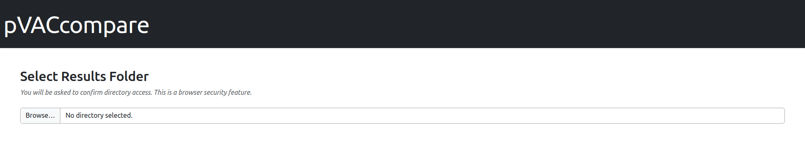
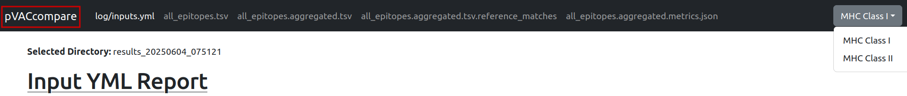

.. _comparison_tool:

Comparison Tool
===============

pVACtools includes a file comparison utility designed to help users compare results across different runs
of the same dataset. This tool is particularly useful for identifying changes introduced by updates to pVACtools,
such as algorithm improvements or altered default parameters. By highlighting differences between result files,
it enables users to validate consistency, track the impact of software changes, and ensure reproducibility in their workflows.

The comparison includes the following pVACseq output files, along with the ``inputs.yml`` file,
which records the inputs used for each specific pipeline run:

.. list-table::
   :header-rows: 1

   * - File Name
     - Description
   * - ``<sample_name>.all_epitopes.tsv``
     - A list of all predicted epitopes and their binding affinity scores, with
       additional variant information from the ``<sample_name>.tsv``. Only
       epitopes resulting from supported variants (missense, inframe indels, and frameshifts)
       are included. If the ``--pass-only`` flag is
       set, variants that have a FILTER set in the VCF are excluded.
   * - ``<sample_name>.all_epitopes.aggregated.tsv``
     - An aggregated version of the ``all_epitopes.tsv`` file that gives information about
       the best epitope for each mutation in an easy-to-read format. Not
       generated when running only with presentation and immunogenicity algorithms.
   * - ``<sample_name>.all_epitopes.aggregated.tsv.reference_matches``
     - A file outlining details of reference proteome matches
   * - ``<sample_name>.all_epitopes.aggregated.metrics.json``
     - A JSON file with detailed information about the predicted epitopes,
       formatted for pVACview. This file, in combination with the
       aggregated.tsv file, is required to visualize your results
       in pVACview. Not generated when running only with presentation and immunogenicity algorithms.

Usage
-----

.. program-output:: pvactools compare -h

Viewing results
---------------

Once the comparison has completed, a local web server will automatically be launched, provided the ``--no-server``
option was not used. If you wish to start the server manually at a later time, you can do so by running the
comparison tool again with the ``--start-server`` parameter.

After the server is running, navigate to the provided link in your browser. This will open the report
interface, which should resemble the following:

    
To begin viewing results select the target results folder using the file selection tool, then click the
"Confirm and Load Files" button.

This will open a detailed comparison page, where you can review differences across each of the included
output files. Use the "pVACcompare" button in the top-left corner to return to the result selection
page at any time. Use the MHC class dropdown in the top-right corner to toggle between Class I and 
Class II results (this option will only be available if results for both classes were included in the comparison).

