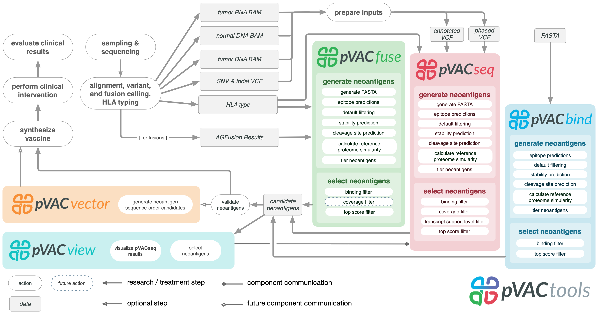

pVACtools
=========

pVACtools is a cancer immunotherapy tools suite consisting of the following
tools:

**pVACseq**
   A cancer immunotherapy pipeline for identifying and prioritizing neoantigens from a VCF file.

**pVACbind**
   A cancer immunotherapy pipeline for identifying and prioritizing neoantigens from a FASTA file.

**pVACfuse**
   A tool for detecting neoantigens resulting from gene fusions.

**pVACvector**
   A tool designed to aid specifically in the construction of DNA-based
   cancer vaccines.

**pVACview**
   An application based on R Shiny that assists
   users in reviewing, exploring and prioritizing neoantigens from the results of
   pVACtools processes for personalized cancer vaccine design.

Contents
--------

.. toctree::
   :maxdepth: 2

   pvacseq
   pvacbind
   pvacfuse
   pvacvector
   pvacview

.. toctree::
   :maxdepth: 1

   install
   tools
   frequently_asked_questions
   releases
   license
   citation
   contribute
   contact
   mailing_list

New in Version |version|
------------------------

This version adds the following features, outlined below. Please note that
pVACtools 3.0 is not backwards-compatible and certain changes will break old
workflows.

Breaking Changes
________________

- The pVACapi and pVACviz tools have been removed. They have been replaced by
  the :ref:`pvacview` tool.
- The package namespace has been updated. The files will now be installed
  underneath a ``pvactools`` directory in your python package installation
  path.
- The aggregated report format has been updated. The headers have been updated for
  clarity. An additional column ``Allele Expr`` has been added, representing
  RNA expression * RNA VAF. For more information see :ref:`aggregated`.
- pVACfuse no longer supports inputs from Integrate NEO. Only AGFusion inputs
  will be supported going forward.
- pVACfuse report format update

New Features
____________

- This release adds a new tool, :ref:`pvacview`. pVACview is an R Shiny application that
  allows for that visualization of the pVACseq aggregated report file to review, explore,
  and prioritize the different neoantigen candidates predicted by pVACseq.
- The 3.0 release adds several improvements to the reference proteome
  similarity step:

  - Users can now run the reference proteome similarity step with a standalone
    Protein BLAST installation. To use a standalone BLASTp installation, provide the
    installation path using the ``--blastp-path`` parameter. The supported
    Protein BLAST databases are ``refseq_select_prot`` and ``refseq_protein``.
    TODO: link to installation instructions
  - When running the reference proteome similarity step using the NCBI Protein BLAST API,
    users can now pick between the ``refseq_select_prot`` and ``refseq_protein``
    databases.
  - Parallelization has been added to the reference proteome similarity step.
    When running this step as part of the pVACseq, pVACfuse, or pVACbind
    pipelines, the existing ``--t`` parameter will also be used to set the number of
    parallel threads in this step.

- This release adds standalone commands to run stability predictions, cleavage
  site predictions, and the reference proteome similarity step on the output
  of the pVACseq, pVACfuse, and pVACbind pipelines. TODO: link to docs pages
  for commands

Minor Updates
_____________

- Previously, when running NetChop for cleavage site predictions, predictions
  were made for each epitope individually. However, these predictions will
  differ if additional flanking amino acids are provided and will be stable
  with 9 or more flanking amino acids. We updated this step to make predictions
  with 9 flanking amino acids around each epitope to generate stable
  predictions.
- This release adds a ``--species`` option to the ``valid_alleles`` commands
  to filter alleles on a species of interest. TODO: link to command
- This release adds a ``--pass-only`` flag to the ``pvacseq
  generate_protein_fasta`` commands to only process VCF entries that do not
  have a FILTER set.

Past release notes can be found on our :ref:`releases` page.

To stay up-to-date on the latest pVACtools releases please join our :ref:`mailing_list`.

Citations
---------

Jasreet Hundal , Susanna Kiwala , Joshua McMichael, Chris Miller, Huiming Xia,
Alex Wollam, Conner Liu, Sidi Zhao, Yang-Yang Feng, Aaron Graubert, Amber Wollam,
Jonas Neichin, Megan Neveau, Jason Walker, William Gillanders,
Elaine Mardis, Obi Griffith, Malachi Griffith. pVACtools: A Computational Toolkit to
Identify and Visualize Cancer Neoantigens. Cancer Immunology Research.
2020 Mar;8(3):409-420. doi: 10.1158/2326-6066.CIR-19-0401.
PMID: `31907209 <https://www.ncbi.nlm.nih.gov/pubmed/31907209>`_.

Jasreet Hundal, Susanna Kiwala, Yang-Yang Feng, Connor J. Liu, Ramaswamy Govindan, William C. Chapman,
Ravindra Uppaluri, S. Joshua Swamidass, Obi L. Griffith, Elaine R. Mardis, and Malachi Griffith.
`Accounting for proximal variants improves neoantigen prediction <https://www.nature.com/articles/s41588-018-0283-9>`_.
Nature Genetics. 2018, DOI: 10.1038/s41588-018-0283-9. PMID: `30510237 <https://www.ncbi.nlm.nih.gov/pubmed/30510237>`_.

Jasreet Hundal, Beatriz M. Carreno, Allegra A. Petti, Gerald P. Linette, Obi
L. Griffith, Elaine R. Mardis, and Malachi Griffith. `pVACseq: A genome-guided
in silico approach to identifying tumor neoantigens <http://www.genomemedicine.com/content/8/1/11>`_. Genome Medicine. 2016,
8:11, DOI: 10.1186/s13073-016-0264-5. PMID: `26825632
<http://www.ncbi.nlm.nih.gov/pubmed/26825632>`_.

Source code
-----------
The pVACtools source code is available in `GitHub <https://github.com/griffithlab/pVACtools>`_.

License
-------
This project is licensed under `BSD 3-Clause Clear License <https://spdx.org/licenses/BSD-3-Clause-Clear.html>`_.
