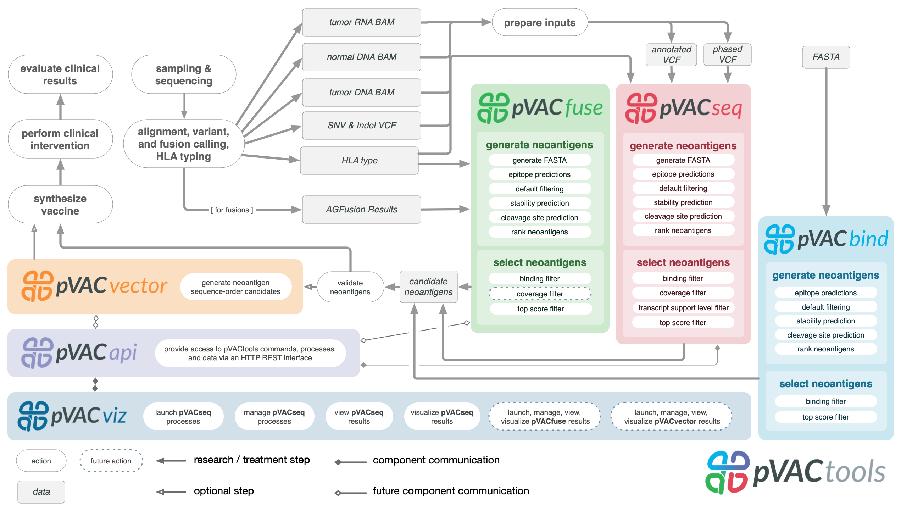

pVACtools
=========

pVACtools is a cancer immunotherapy tools suite consisting of the following
tools:

**pVACseq**
   A cancer immunotherapy pipeline for identifying and prioritizing neoantigens from a VCF file.

**pVACbind**
   A cancer immunotherapy pipeline for identifying and prioritizing neoantigens from a FASTA file.

**pVACfuse**
   A tool for detecting neoantigens resulting from gene fusions.

**pVACvector**
   A tool designed to aid specifically in the construction of DNA-based
   cancer vaccines.

**pVACviz**
   A browser-based user interface that assists
   users in launching, managing, reviewing, and visualizing the results of
   pVACtools processes.

**pVACview**
   An application based on R Shiny that assists
   users in reviewing, exploring and prioritizing neoantigens from the results of
   pVACtools processes for personalized cancer vaccine design.

.. toctree::
   :maxdepth: 2

   pvacseq
   pvacbind
   pvacfuse
   pvacvector
   pvacviz
   pvacview

.. toctree::
   :maxdepth: 1

   install
   tools
   frequently_asked_questions
   releases
   license
   citation
   contribute
   contact
   mailing_list

New in release |release|
------------------------

This is a bugfix release. It fixes the following problem(s):

- This releases fixes an edge case that would result in an error when the proximal
  variant VCF didn't contain a region from the somatic VCF.

New in version |version|
------------------------

This version adds the following features, outlined below. Please note that
pVACtools 2.0 is not backwards-compatible and certain changes will break old
workflows.

Breaking changes
________________

- pVACtools now supports variable epitope lengths for class II prediction algorithms. The previous option
  ``--epitope-length`` (``-e``) no longer exists. It has been replaced with
  ``--class-i-epitope-length`` (``-e1``) and ``--class-ii-epitope-length``
  (``-e2``) for class I and class II epitope lengths, respectively. The
  defaults are ``[8, 9, 10, 11]`` and ``[12, 13, 14, 15, 16, 17, 18]``,
  respectively.
- The ``--peptide-sequence-length`` option has been removed. The peptide
  sequence length is now determined by the epitope length(s) to determine the
  flanking sequence length before and after the mutation.
- pVACtools no longer depends on conda. pVACtools remains compatible with
  Python 3.5 and above but users may chose any environment manager to set up
  an appropriate Python environment.
- When using standalone IEDB, pVACtools is now only compatible with IEDB 3.1
  and above. Please see :ref:`install` for instructions on installing the
  latest IEDB version.
- pVACseq is no longer dependent on annotations with the VEP Downstream
  plugin. This dependency has been replaced with the VEP Frameshift plugin.
  This requires changes to your existing VEP installation in order to install
  the Frameshift plugin. Existing VCFs that were previously annotated to work
  with pVACtools 1.5 and below will no longer work with version 2.0 and above
  and will need to be reannotated. Please see our documentation on :ref:`vep`
  for more information.
- The filtered.condensed.tsv report has been removed and replaced with the
  all_epitopes.aggregated.tsv report. We believe that this new report will
  provide a more useful summary of your
  results. Please see the Output Files sections of each tool for more
  information on this new report.

New features
____________

- pVACtools now provides binding affinity percentile rank information, in
  addition to the raw ic50 binding affinity values. Users may filter on the
  percentile rank by using the new ``--percentile-threshold`` argument.
- Users now have the option of calculating the reference proteome similarity
  of their filtered epitopes. For this, the peptide sequence for the
  remaining variants is mapped to the reference proteome using BLAST. Variants
  where this yields a hit to a reference proteome are marked accordingly and a
  ``.reference_matches`` file provides more information about the matches.
  This option can be enabled using the ``--run-reference-proteome-similarity``
  option.
- Users may now use the options ``all``, ``all_class_i``, or ``all_class_ii``
  instead of specific prediction algorithms in order to run all prediction
  algorithms, all class I prediction algorithms, or all class II prediction
  algorithms, respectively.
- For successful pVACvector runs, we now output a ``_results.dna.fa`` file
  with the most likely nucleic acid sequence for the predicted vector.

Minor Updates
_____________

- When running pVACseq with a proximal variants VCF we would previously assume
  that your ran VEP with the ``--pick`` option and only process the first transcript
  annotation for a variant. With this update we will now associate the correct
  transcript for a proximal variant with the matching transcript of the main
  somatic variant of interest.
- The ``pvacseq generate_protein_fasta`` command now allows users to provide a
  proximal variants VCF using the ``--phased-proximal-variants-vcf`` option.
- The ``pvacseq generate_protein_fasta`` command now supports multi-sample
  VCFs. Users may use the ``--sample-name`` to provide the sample name of the
  sample they wish to process.
- pVACseq and pVACfuse would previously error out if the intermediate TSV
  parsed from the input was empty. In 2.0 the tool will no longer
  error out but exit with an appropriate message.
- pVACvector would previously error out when no valid path was found. In 2.0
  pVACvector will not longer error out but exit with an appropriate message.
- We now set consistent file permissions on all output files.
- We've updated our license to BSD 3-Cause Clear. Please note that the
  individual licenses of our dependent tools remain in place. These can be
  viewed by on the :ref:`tools` page.

Past release notes can be found on our :ref:`releases` page.

To stay up-to-date on the latest pVACtools releases please join our :ref:`mailing_list`.

Citations
---------

Jasreet Hundal , Susanna Kiwala , Joshua McMichael, Chris Miller, Huiming Xia,
Alex Wollam, Conner Liu, Sidi Zhao, Yang-Yang Feng, Aaron Graubert, Amber Wollam,
Jonas Neichin, Megan Neveau, Jason Walker, William Gillanders,
Elaine Mardis, Obi Griffith, Malachi Griffith. pVACtools: A Computational Toolkit to
Identify and Visualize Cancer Neoantigens. Cancer Immunology Research.
2020 Mar;8(3):409-420. doi: 10.1158/2326-6066.CIR-19-0401.
PMID: `31907209 <https://www.ncbi.nlm.nih.gov/pubmed/31907209>`_.

Jasreet Hundal, Susanna Kiwala, Yang-Yang Feng, Connor J. Liu, Ramaswamy Govindan, William C. Chapman,
Ravindra Uppaluri, S. Joshua Swamidass, Obi L. Griffith, Elaine R. Mardis, and Malachi Griffith.
`Accounting for proximal variants improves neoantigen prediction <https://www.nature.com/articles/s41588-018-0283-9>`_.
Nature Genetics. 2018, DOI: 10.1038/s41588-018-0283-9. PMID: `30510237 <https://www.ncbi.nlm.nih.gov/pubmed/30510237>`_.

Jasreet Hundal, Beatriz M. Carreno, Allegra A. Petti, Gerald P. Linette, Obi
L. Griffith, Elaine R. Mardis, and Malachi Griffith. `pVACseq: A genome-guided
in silico approach to identifying tumor neoantigens <http://www.genomemedicine.com/content/8/1/11>`_. Genome Medicine. 2016,
8:11, DOI: 10.1186/s13073-016-0264-5. PMID: `26825632
<http://www.ncbi.nlm.nih.gov/pubmed/26825632>`_.

Source code
-----------
The pVACtools source code is available in `GitHub <https://github.com/griffithlab/pVACtools>`_.

License
-------
This project is licensed under `BSD 3-Clause Clear License <https://spdx.org/licenses/BSD-3-Clause-Clear.html>`_.
