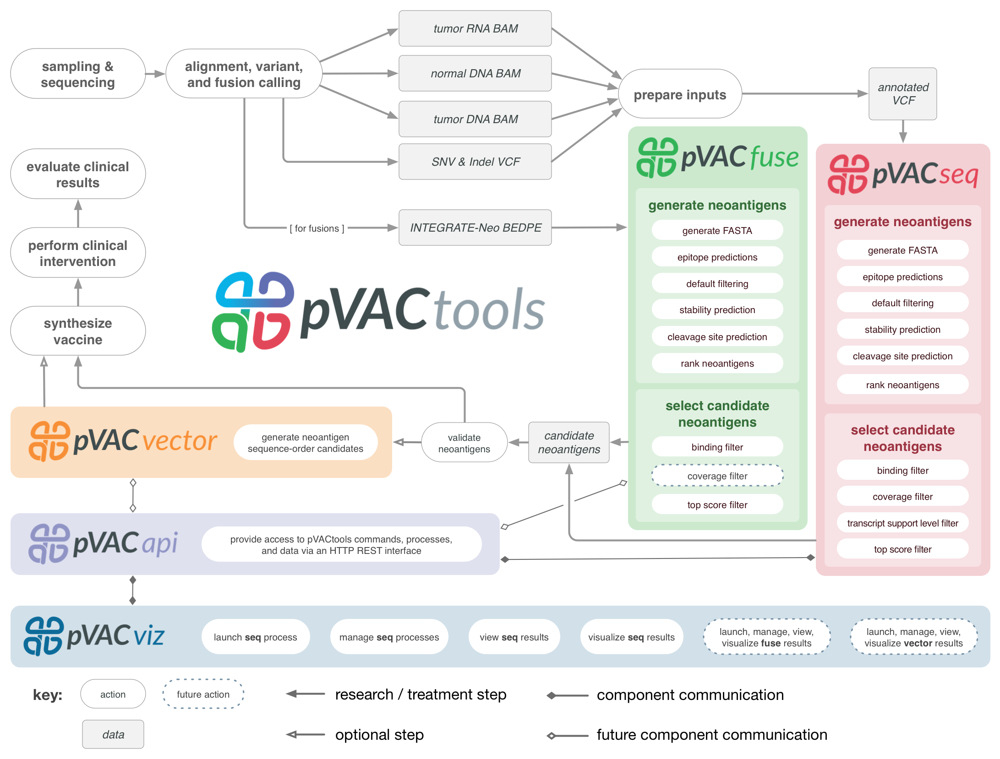

pVACtools
=========

pVACtools is a cancer immunotherapy tools suite consisting of the following
tools:

**pVACseq**
   A cancer immunotherapy pipeline for identifying and prioritizing neoantigens from a list of tumor mutations.

**pVACfuse**
   A tool for detecting neoantigens resulting from gene fusions.

**pVACvector**
   A tool designed to aid specifically in the construction of DNA-based
   cancer vaccines.

**pVACviz**
   A browser-based user interface that assists
   users in launching, managing, reviewing, and visualizing the results of
   pVACtools processes.

.. toctree::
   :maxdepth: 2

   pvacseq
   pvacfuse
   pvacvector
   pvacviz

.. toctree::
   :maxdepth: 1

   install
   tools
   frequently_asked_questions
   releases
   citation
   contact
   mailing_list

New in release |release|
------------------------

This is a hotfix release. It fixes the following issues:

- This version starts enforcing a file
  size limit (14MB) to be able to visualize a result file in pVACviz.
  Larger files will no longer be
  visualizable in pVACviz since they take too long to load.

New in version |version|
------------------------

This version adds the following features:

- pVACvector now tests spacers iteratively. During the first iteration, the
  first spacer in the list of ``--spacers`` gets tested. In the next
  iteration, the next spacer in the list gets added to the pool of spacers to
  tests, and so on. If at any point a valid ordering is found, pVACvector will
  finish its run and output the result. This might result in slightly
  less optimal (but still valid) ordering but improves runtime significantly.
- If, after testing all spacers, no valid ordering if found, pVACvector will
  clip the beginning and/or ends of problematic peptides by one amino acid.
  The ordering finding process is then repeated on the updated list of
  peptides. This process may be repeated up to a maximum set by the
  ``--max-clip-length`` parameter.
- This version adds a standalone command to create the pVACvector
  visualizations that can be run by calling ``pvacvector visualize`` using a
  pVACvector result file as the input.
- We removed the ``--aditional-input-file-list`` option to pVACseq. Readcount and
  expression information are now taken directly from the VCF annotations.
  Instructions on how to add these annotations to your input VCF can be found
  on the :ref:`prerequisites_label` page.
- We added support for variants to pVACseq that are only annotated as
  ``protein_altering_variant`` without a more specific consequence of
  ``missense_variant``, ``inframe_insertion``, ``inframe_deletion``, or ``frameshift_variant``.
- We resolved some syntax differences that prevented pVACtools from being run
  under python 3.6 or python 3.7. pVACtools should now be compatible with all
  python3 versions.

Past release notes can be found on our :ref:`releases` page.

To stay up-to-date on the latest pVACtools releases please join our :ref:`mailing_list`.

Citations
---------

Jasreet Hundal, Susanna Kiwala, Joshua McMichael, Christopher A Miller,
Alexander T Wollam, Huiming Xia, Connor J Liu, Sidi Zhao, Yang-Yang Feng,
Aaron P Graubert, Amber Z Wollam, Jonas Neichin, Megan Neveau, Jason Walker,
William E Gillanders, Elaine R Mardis, Obi L Griffith, Malachi Griffith.
`pVACtools: a computational toolkit to select and visualize cancer
neoantigens <https://doi.org/10.1101/501817>`_.
bioRxiv 501817; doi: https://doi.org/10.1101/501817

Jasreet Hundal, Susanna Kiwala, Yang-Yang Feng, Connor J. Liu, Ramaswamy Govindan, William C. Chapman, Ravindra Uppaluri, S. Joshua Swamidass, Obi L. Griffith, Elaine R. Mardis, and Malachi Griffith. `Accounting for proximal variants improves neoantigen prediction <https://www.nature.com/articles/s41588-018-0283-9>`_. Nature Genetics. 2018, DOI: 10.1038/s41588-018-0283-9. PMID: `30510237 <https://www.ncbi.nlm.nih.gov/pubmed/30510237>`_.

Jasreet Hundal, Beatriz M. Carreno, Allegra A. Petti, Gerald P. Linette, Obi
L. Griffith, Elaine R. Mardis, and Malachi Griffith. `pVACseq: A genome-guided
in silico approach to identifying tumor neoantigens <http://www.genomemedicine.com/content/8/1/11>`_. Genome Medicine. 2016,
8:11, DOI: 10.1186/s13073-016-0264-5. PMID: `26825632
<http://www.ncbi.nlm.nih.gov/pubmed/26825632>`_.

License
-------
This project is licensed under `NPOSL-3.0 <http://opensource.org/licenses/NPOSL-3.0>`_.
