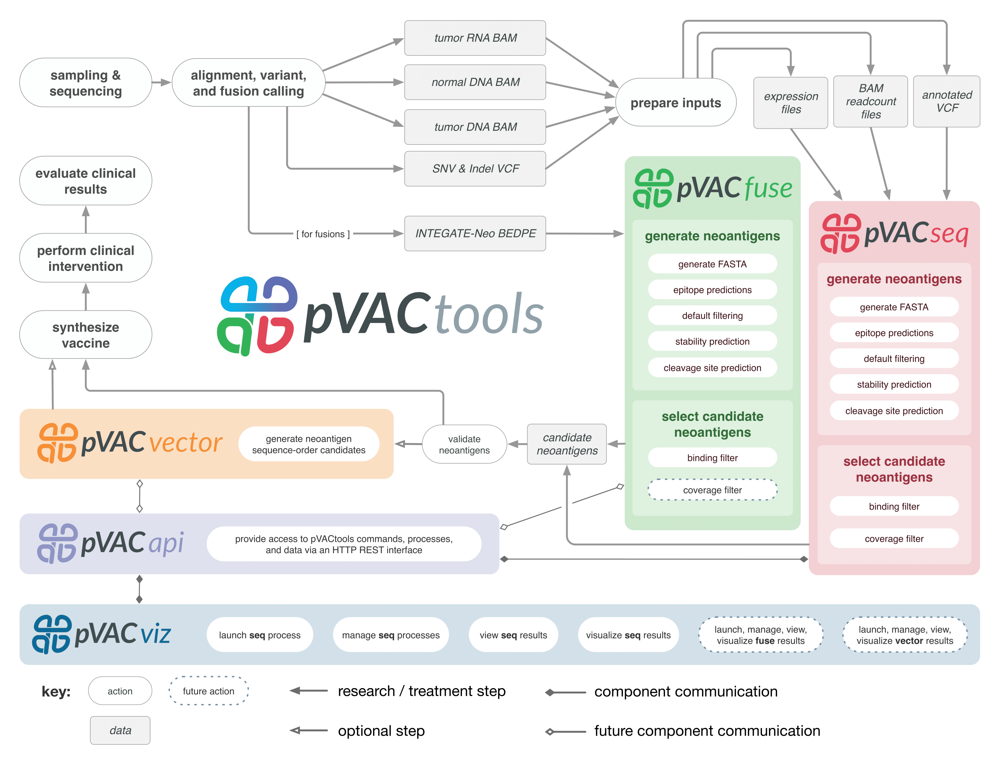

pVACtools
=========

pVACtools is a cancer immunotherapy tools suite consisting of the following
tools:

**pVACseq**
   A cancer immunotherapy pipeline for identifying and prioritizing neoantigens from a list of tumor mutations.

**pVACfuse**
   A tool for detecting neoantigens resulting from gene fusions.

**pVACvector**
   A tool designed to aid specifically in the construction of DNA-based
   cancer vaccines.

**pVACviz**
   A browser-based user interface that assists
   users in launching, managing, reviewing, and visualizing the results of
   pVACtools processes.

.. toctree::
   :maxdepth: 2

   pvacseq
   pvacfuse
   pvacvector
   pvacviz

.. toctree::
   :maxdepth: 1

   install
   frequently_asked_questions
   contact

New in version |version|
------------------------

This version adds a host of new features to pVACtools:

- pVACseq is now able to parse VAF, depth, and expression information directly
  from the VCF. This makes the ``--additional-input-file-list`` option
  obsolete. The ``--additional-input-file-list`` option is now deprecated and will be removed in an
  upcoming release. For more information on how to annotated your VCF with
  readcount and expression information, see the :ref:`prerequisites_label` page.
- pVACseq is now able to handle proximal germline and somatic variants. In
  order to incorporate those into the epitope predictions, you will need to
  provide a phased variants VCF to your pVACseq run using the
  ``--phased-proximal-variants-vcf`` option
- We added support to pVACseq for filering on transcript support levels. This requires
  the input VCF to be annotated with the TSL field by VEP.
- The binding filter of pVACseq and pVACfuse can now be run with flexible, allele-specific
  binding-thresholds. This feature can be enabled using the
  ``--allele-specific-binding-thresholds`` option.
- pVACseq now supports a ``--pass-only`` flag that will result in any VCF
  entries with a ``FILTER`` to be skipped. Usin this flag, only VCF entries
  with a ``FILTER`` of ``PASS`` or ``.`` will be processed.
- We added support for MHCflurry and MHCnuggets prediction algorithms. These
  can be run listing ``MHCflurry``, ``MHCnuggetsI`` (for MHC Class I alleles),
  and/or ``MHCnuggetsII`` (for MHC Class II alleles) as the prediction
  algorithms.
- We now offer a graphical user interface, :ref:`pvacviz`, to run pVACseq instead of using the
  command line. pVACviz, can also be used to plot and filter your pVACseq
  results.

Citation
--------

Jasreet Hundal, Beatriz M. Carreno, Allegra A. Petti, Gerald P. Linette, Obi
L. Griffith, Elaine R. Mardis, and Malachi Griffith. `pVACseq: A genome-guided
in silico approach to identifying tumor neoantigens <http://www.genomemedicine.com/content/8/1/11>`_. Genome Medicine. 2016,
8:11, DOI: 10.1186/s13073-016-0264-5. PMID: `26825632
<http://www.ncbi.nlm.nih.gov/pubmed/26825632>`_.

License
-------
This project is licensed under `NPOSL-3.0 <http://opensource.org/licenses/NPOSL-3.0>`_.
