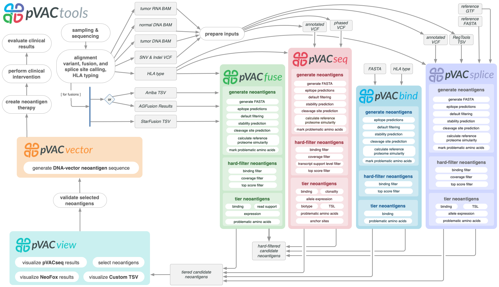

pVACtools
=========

pVACtools is a cancer immunotherapy tools suite consisting of the following
tools:

**pVACseq**
   A cancer immunotherapy pipeline for identifying and prioritizing neoantigens from a VCF file.

**pVACbind**
   A cancer immunotherapy pipeline for identifying and prioritizing neoantigens from a FASTA file.

**pVACfuse**
   A tool for detecting neoantigens resulting from gene fusions.

**pVACsplice**
   A tool for detecting neoantigens resulting from splice site variants.

**pVACvector**
   A tool designed to aid specifically in the construction of DNA-based
   cancer vaccines.

**pVACview**
   An application based on R Shiny that assists
   users in reviewing, exploring and prioritizing neoantigens from the results of
   pVACtools processes for personalized cancer vaccine design.

Contents
--------

.. toctree::
   :maxdepth: 2

   pvacseq
   pvacbind
   pvacfuse
   pvacsplice
   pvacvector
   pvacview

.. toctree::
   :maxdepth: 1

   install
   helper_tools
   courses
   tools
   frequently_asked_questions
   releases
   license
   citation
   funding
   contribute
   contact
   mailing_list

New in Version |release|
------------------------

This is a bugfix release. It fixes the following problem(s):

* Ensure that the top_score_metric2 parameter is passed through to UpdateTiers so that the aggregate report gets sorted correctly. by @susannasiebert in https://github.com/griffithlab/pVACtools/pull/1335

New in Version 6
----------------

This is a major version release. Please note that pVACtools 6.0 is not guaranteed to be
backwards-compatible and certain changes could break old workflows. It also
removes support for Python 3.7 and 3.8.

New Tools
_________

- A new tool, pVACcompare allows users to visualize differences between output
  files from different pVACtools versions. This tool may be useful when
  investigating changes to predicted neoantigens between versions in
  controlled experiments where enumerating and explaning such differences may be
  crucial, e.g. in clinical trials. The tool can be run using the ``pvactools
  compare`` command. For more information please see the
  `Comparison Tool documentation
  <https://pvactools.readthedocs.io/en/staging/helper_tools/comparison_tool.html>`_.
- A new standalone command ``pvacseq create_peptide_ordering_form`` generates
  peptide ordering files (FASTA, annotated ordering Excel spreadsheet,
  and review template Excel spreadsheet) to streamline preparation of peptides
  for synthesis and review. For more information please see the `documentation
  <https://pvactools.readthedocs.io/en/latest/pvacseq/optional_downstream_analysis_tools.html#create-peptide-ordering-form>`_

New Features
____________

- pVACseq and pVACsplice now take into account the MANE Select and Canonical status of a transcript
  for filtering, prioritizing, and tiering a neoantigen candidate. MANE Select, Canonical, and TSL
  status is evaluated according to the new ``--transcript-prioritization-strategy`` parameter. This
  parameter allows users to list one or more critieria (``mane_select``, ``canonical``, ``tsl``) to
  take into consideration. As part of this update the "transcript support level filter" has been
  renamed to "transcript filter" including the standalone command which is now
  ``pvacseq|pvacsplice transcript_filer`` instead of ``pvacseq|pvacsplice transcript_support_level_filter``.
- The aggregate report tiers have been updated to add four new tier:

  - ``PoorBinder``: candidate fails the binding criteria but passes all other critieria.
  - ``RefMatch``: candidate has a reference match but passes all other criteria.
  - ``ProbPos``: candidate has a problematic amino acid but passes all other criteria.
  - ``PoorTranscript``: a candidate's best transcript is neither MANE Select, Canonical, nor meets
    the TSL cutoff (depending on the specified ``transcript-prioritization-strategy``; only available
    in pVACseq and pVACsplice).

- By default, transcripts where the FLAGS VEP annotation is set will now be filtered out before processing
  by pVACseq and pVACsplice. This field identifies transcripts where the CDS 5' or 3' is incomplete. A new
  parameter ``--allow-incomplete-transcripts`` has been added which can be used to replicate the previous
  behavior where such transcripts were included.
- The pVACsplice logic for aggregating variants in the aggregate report creation has been updated to
  aggregate neoantigen candidates from the same Junction together instead of using the Index.
- Output file names of the reports have been updated to include MHC_I/MHC_II/Combined prefixes for easier
  identification of the type of output file.

Bugfixes
________

- This relase fixes a bug with sorting of pVACfuse output files.

Past release notes can be found on our :ref:`releases` page.

To stay up-to-date on the latest pVACtools releases please join our :ref:`mailing_list`.

Citations
---------

Jasreet Hundal , Susanna Kiwala , Joshua McMichael, Chris Miller, Huiming Xia,
Alex Wollam, Conner Liu, Sidi Zhao, Yang-Yang Feng, Aaron Graubert, Amber Wollam,
Jonas Neichin, Megan Neveau, Jason Walker, William Gillanders,
Elaine Mardis, Obi Griffith, Malachi Griffith. pVACtools: A Computational Toolkit to
Identify and Visualize Cancer Neoantigens. Cancer Immunology Research.
2020 Mar;8(3):409-420. doi: 10.1158/2326-6066.CIR-19-0401.
PMID: `31907209 <https://www.ncbi.nlm.nih.gov/pubmed/31907209>`_.

Jasreet Hundal, Susanna Kiwala, Yang-Yang Feng, Connor J. Liu, Ramaswamy Govindan, William C. Chapman,
Ravindra Uppaluri, S. Joshua Swamidass, Obi L. Griffith, Elaine R. Mardis, and Malachi Griffith.
`Accounting for proximal variants improves neoantigen prediction <https://www.nature.com/articles/s41588-018-0283-9>`_.
Nature Genetics. 2018, DOI: 10.1038/s41588-018-0283-9. PMID: `30510237 <https://www.ncbi.nlm.nih.gov/pubmed/30510237>`_.

Jasreet Hundal, Beatriz M. Carreno, Allegra A. Petti, Gerald P. Linette, Obi
L. Griffith, Elaine R. Mardis, and Malachi Griffith. `pVACseq: A genome-guided
in silico approach to identifying tumor neoantigens <http://www.genomemedicine.com/content/8/1/11>`_. Genome Medicine. 2016,
8:11, DOI: 10.1186/s13073-016-0264-5. PMID: `26825632
<http://www.ncbi.nlm.nih.gov/pubmed/26825632>`_.

Huiming Xia, My H. Hoang, Evelyn Schmidt, Susanna Kiwala, Joshua McMichael, Zachary L. Skidmore, Bryan Fisk, Jonathan J. Song, Jasreet Hundal, Thomas Mooney, Jason R. Walker, S. Peter Goedegebuure, Christopher A. Miller, William E. Gillanders, Obi L. Griffith,  Malachi Griffith. `pVACview: an interactive visualization tool for efficient neoantigen prioritization and selection <https://genomemedicine.biomedcentral.com/articles/10.1186/s13073-024-01384-7>`_. Genome Medicine. 2024, 16:132, DOI: 10.1186/s13073-024-01384-7. PMID: `39538339 <http://www.ncbi.nlm.nih.gov/pubmed/39538339>`_. 

Source code
-----------
The pVACtools source code is available in `GitHub <https://github.com/griffithlab/pVACtools>`_.

License
-------
This project is licensed under `BSD 3-Clause Clear License <https://spdx.org/licenses/BSD-3-Clause-Clear.html>`_.
