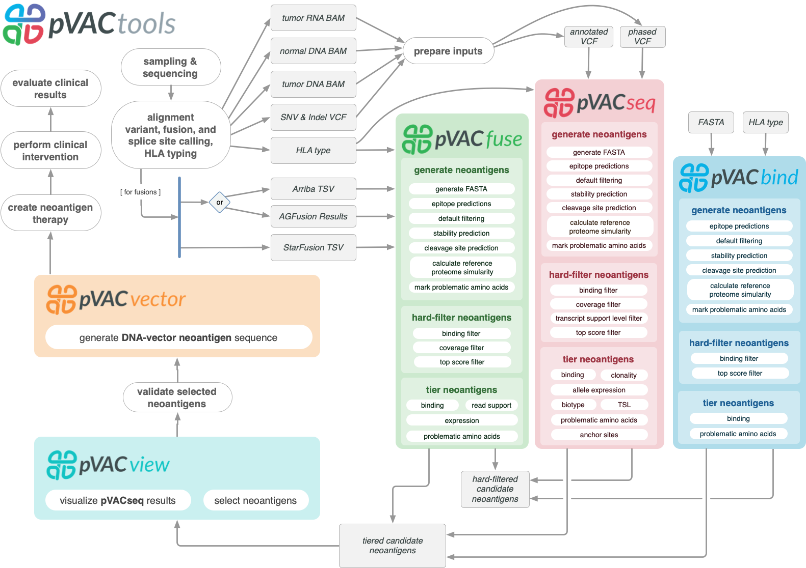

pVACtools
=========

pVACtools is a cancer immunotherapy tools suite consisting of the following
tools:

**pVACseq**
   A cancer immunotherapy pipeline for identifying and prioritizing neoantigens from a VCF file.

**pVACbind**
   A cancer immunotherapy pipeline for identifying and prioritizing neoantigens from a FASTA file.

**pVACfuse**
   A tool for detecting neoantigens resulting from gene fusions.

**pVACvector**
   A tool designed to aid specifically in the construction of DNA-based
   cancer vaccines.

**pVACview**
   An application based on R Shiny that assists
   users in reviewing, exploring and prioritizing neoantigens from the results of
   pVACtools processes for personalized cancer vaccine design.

Contents
--------

.. toctree::
   :maxdepth: 2

   pvacseq
   pvacbind
   pvacfuse
   pvacvector
   pvacview

.. toctree::
   :maxdepth: 1

   install
   tools
   frequently_asked_questions
   releases
   license
   citation
   contribute
   contact
   mailing_list

New in Version |version|
------------------------

This version adds the following features, outlined below. Please note that
pVACtools 4.0 is not backwards-compatible and certain changes will break old
workflows.

Breaking Changes
________________

- pVACseq|pVACfuse|pVACbind report files have been reformatted to add some
  additional information and, in the case of pVACfuse and pVACbind, remove
  columns where all values were ``NA``. Existing output files will no longer
  work with the standalone commands as well as pVACview.
- The format of the Mutation Position column has been updated to no longer use
  0 and n+1 to denote mutations starting before or ending after the epitope.
  This column now only shows the actually mutated positions.

New Features
____________

- We now support MHCflurry and NetMHCpanEL elution algorithms.
- Users are now able to select specific amino acids that would be problematic for
  vaccine manufacturing and have the pipelines mark epitopes with such amino
  acids.
- When running the reference proteome similarity step, users are now able to
  specify a peptide fasta to search against instead of using BLAST. Any exact
  matches against the entries in the peptide fasta are counted as a hit.
- The aggregate report now takes into account many command line thresholds
  when tiering candidates. We also refined the way we determine the Best
  Peptide to take into account the biotype and TSL of the transcripts coding
  for the peptide, and whether or not the candidate has any problematic
  positions or fails the anchor criteria. Please see the :ref:`output file
  section <pvacseq_best_peptide>` of the documentation for more details.
- pVACview has been updated with a host of new features

  - Users may adjust a wider variety of thresholds for retiering.
  - Users are now able to reset the tiering thresholds to the ones originally
    used when running pVACview.
  - Transcripts resulting in the same set of epitope candidates are now
    grouped together to make it easier to identify unique candidates.
  - Elution data is displayed in the epitope details section of pVACview.
  - Reference match details are displayed in the transcript set details
    section of pVACview.

- pVACfuse now supports output files from Arriba for fusion peptide
  predictions.
- Users may provide an optional STAR-fusion output file to their pVACfuse run
  in order to extract expression and read support data for their candidates.
  These will be used for filtering, as well as for tiering in the aggregate
  report. Please see the :ref:`output file section <pvacfuse_output_files>` of the documention for
  more details.
- When running the ``pvacseq generate_protein_fasta`` command, users are now
  able to specify an aggregated report as the ``--input-tsv``. When using such
  a TSV, they can also use the ``--aggregate-report-evaluation`` to specify
  Evaluation statuses to include in the protein fasta. This is useful when creating
  a peptide fasta for vaccine ordering after using pVACview
  to select vaccine candidates and exporting the results to a new TSV.

Minor Changes
_____________

- The reference proteome step is now run on the aggregated report instead of
  the filtered report.

Past release notes can be found on our :ref:`releases` page.

To stay up-to-date on the latest pVACtools releases please join our :ref:`mailing_list`.

Citations
---------

Jasreet Hundal , Susanna Kiwala , Joshua McMichael, Chris Miller, Huiming Xia,
Alex Wollam, Conner Liu, Sidi Zhao, Yang-Yang Feng, Aaron Graubert, Amber Wollam,
Jonas Neichin, Megan Neveau, Jason Walker, William Gillanders,
Elaine Mardis, Obi Griffith, Malachi Griffith. pVACtools: A Computational Toolkit to
Identify and Visualize Cancer Neoantigens. Cancer Immunology Research.
2020 Mar;8(3):409-420. doi: 10.1158/2326-6066.CIR-19-0401.
PMID: `31907209 <https://www.ncbi.nlm.nih.gov/pubmed/31907209>`_.

Jasreet Hundal, Susanna Kiwala, Yang-Yang Feng, Connor J. Liu, Ramaswamy Govindan, William C. Chapman,
Ravindra Uppaluri, S. Joshua Swamidass, Obi L. Griffith, Elaine R. Mardis, and Malachi Griffith.
`Accounting for proximal variants improves neoantigen prediction <https://www.nature.com/articles/s41588-018-0283-9>`_.
Nature Genetics. 2018, DOI: 10.1038/s41588-018-0283-9. PMID: `30510237 <https://www.ncbi.nlm.nih.gov/pubmed/30510237>`_.

Jasreet Hundal, Beatriz M. Carreno, Allegra A. Petti, Gerald P. Linette, Obi
L. Griffith, Elaine R. Mardis, and Malachi Griffith. `pVACseq: A genome-guided
in silico approach to identifying tumor neoantigens <http://www.genomemedicine.com/content/8/1/11>`_. Genome Medicine. 2016,
8:11, DOI: 10.1186/s13073-016-0264-5. PMID: `26825632
<http://www.ncbi.nlm.nih.gov/pubmed/26825632>`_.

Source code
-----------
The pVACtools source code is available in `GitHub <https://github.com/griffithlab/pVACtools>`_.

License
-------
This project is licensed under `BSD 3-Clause Clear License <https://spdx.org/licenses/BSD-3-Clause-Clear.html>`_.
