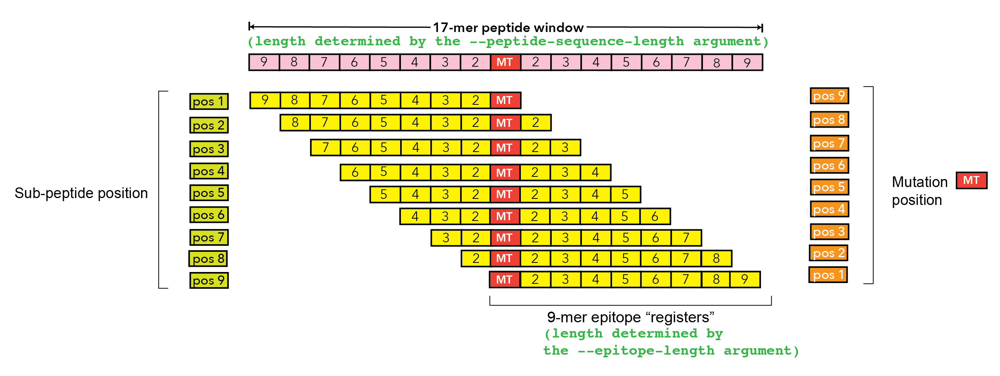

.. image:: ../images/pVACseq_logo_trans-bg_sm_v4b.png
    :align: right
    :alt: pVACseq logo

.. _pvacseq_output_files:

Output Files
============

The pVACseq pipeline will write its results in separate folders depending on
which prediction algorithms were chosen:

- ``MHC_Class_I``: for MHC class I prediction algorithms
- ``MHC_Class_II``: for MHC class II prediction algorithms
- ``combined``: If both MHC class I and MHC class II prediction algorithms were run, this folder combines the neoepitope predictions from both

Each folder will contain the same list of output files (listed in the order
created):

.. list-table::
   :header-rows: 1

   * - File Name
     - Description
   * - ``<sample_name>.tsv``
     - An intermediate file with variant, transcript, coverage, vaf, and expression
       information parsed from the input files.
   * - ``<sample_name>.tsv_<chunks>`` (multiple)
     - The above file but split into smaller chunks for easier processing with IEDB.
   * - ``<sample_name>.fasta``
     - A fasta file with mutant and wildtype peptide subsequences for all
       processable variant-transcript combinations.
   * - ``<sample_name>.net_chop.fa``
     - A fasta file with mutant and wildtype peptide subsequences specific for use in running the net_chop tool.
   * - ``<sample_name>.all_epitopes.tsv``
     - A list of all predicted epitopes and their binding affinity scores, with
       additional variant information from the ``<sample_name>.tsv``. Only
       epitopes resulting from supported variants (missense, inframe indels, and frameshifts)
       are included. If the ``--pass-only`` flag is
       set, variants that have a FILTER set in the VCF are excluded.
   * - ``<sample_name>.filtered.tsv``
     - The above file after applying all filters, with (optionally) cleavage site, stability
       predictions, and reference proteome similarity metrics added.
   * - ``<sample_name>.all_epitopes.aggregated.tsv``
     - An aggregated version of the ``all_epitopes.tsv`` file that gives information about
       the best epitope for each mutation in an easy-to-read format. Not
       generated when running with elution algorithms only.
   * - ``<sample_name>.all_epitopes.aggregated.tsv.reference_matches`` (optional)
     - A file outlining details of reference proteome matches
   * - ``<sample_name>.all_epitopes.aggregated.metrics.json``
     - A JSON file with detailed information about the predicted epitopes,
       formatted for pVACview. This file, in combination with the
       aggregated.tsv file, is required to visualize your results
       in pVACview. Not generated when running with elution algorithms only.
   * - ``ui.R``, ``app.R``, ``server.R``, ``styling.R``, ``anchor_and_helper_functions.R``
     - pVACview R Shiny application files. Not generated when running with elution algorithms only.
   * - ``www`` (directory)
     - Directory containing image files for pVACview. Not generated when running with elution algorithms only.

Filters applied to the filtered.tsv file
----------------------------------------

The filtered.tsv file is the all_epitopes file with the following filters
applied (in order):

- Binding Filter
- Coverage Filter
- Transcript Support Level Filter
- Top Score Filter

Please see the :ref:`Standalone Filter Commands<filter_commands>`
documentation for more information on each individual filter. The standalone
filter commands may be useful to reproduce the filtering or to chose different
filtering thresholds.

Prediction Algorithms Supporting Elution Scores
_______________________________________________

- MHCflurryEL (Presentation and Processing)
- NetMHCpanEL
- NetMHCIIpanEL
- BigMHC_EL

Prediction Algorithms Supporting Immunogenicity Scores
______________________________________________________

- BigMHC_IM
- DeepImmuno

Please note that when running pVACseq with only elution or immunogenicity algorithms, no
aggregate report and pVACview files are created.

Prediction Algorithms Supporting Percentile Information
_______________________________________________________

pVACseq outputs percentile rank information when provided by
a chosen binding affinity, elution, or immunogenicity prediction algorithm.
The following prediction algorithms calculate a
percentile rank:

- MHCflurry
- MHCflurryEL (Presentation)
- MHCnuggets
- NetMHC
- NetMHCcons
- NetMHCpan
- NetMHCpanEL
- NetMHCIIpan
- NetMHCIIpanEL
- NNalign
- PickPocket
- SMM
- SMMPMBEC
- SMMalign

.. _all_ep_and_filtered:

all_epitopes.tsv and filtered.tsv Report Columns
------------------------------------------------

.. list-table::
   :header-rows: 1

   * - Column Name
     - Description
   * - ``Chromosome``
     - The chromosome of this variant
   * - ``Start``
     - The start position of this variant in the zero-based, half-open coordinate system
   * - ``Stop``
     - The stop position of this variant in the zero-based, half-open coordinate system
   * - ``Reference``
     - The reference allele
   * - ``Variant``
     - The alt allele
   * - ``Transcript``
     - The Ensembl ID of the affected transcript
   * - ``Transcript Support Level``
     - The `transcript support level (TSL) <https://useast.ensembl.org/info/genome/genebuild/transcript_quality_tags.html#tsl>`_
       of the affected transcript. ``Not Supported`` if the VCF entry doesn't contain TSL information.
   * - ``Transcript Length``
     - The protein sequence length of the affected transcript
   * - ``Biotype``
     - The biotype of the affected transcript
   * - ``Ensembl Gene ID``
     - The Ensembl ID of the affected gene
   * - ``Variant Type``
     - The type of variant. ``missense`` for missense mutations, ``inframe_ins`` for
       inframe insertions, ``inframe_del`` for inframe deletions, and ``FS`` for frameshift variants
   * - ``Mutation``
     - The amnio acid change of this mutation
   * - ``Protein Position``
     - The protein position of the mutation
   * - ``Gene Name``
     - The Ensembl gene name of the affected gene
   * - ``HGVSc``
     - The HGVS coding sequence variant name
   * - ``HGVSp``
     - The HGVS protein sequence variant name
   * - ``HLA Allele``
     - The HLA allele for this prediction
   * - ``Peptide Length``
     - The peptide length of the epitope
   * - ``Sub-peptide Position``
     - The one-based position of the epitope within the protein sequence used to make the prediction
   * - ``Mutation Position``
     - A comma-separated list of all amino acid positions in the ``MT Epitope Seq`` that are different from the ``WT Epitope Seq``. ``NA`` if the ``WT Epitope Seq`` is ``NA``.
   * - ``MT Epitope Seq``
     - The mutant epitope sequence
   * - ``WT Epitope Seq``
     - The wildtype (reference) epitope sequence at the same position in the full protein sequence. ``NA`` if there is no wildtype sequence at this position or if more than half of the amino acids of the mutant epitope are mutated
   * - ``Best MT IC50 Score Method``
     - Prediction algorithm with the lowest mutant ic50 binding affinity for this epitope
   * - ``Best MT IC50 Score``
     - Lowest ic50 binding affinity of all prediction algorithms used
   * - ``Corresponding WT IC50 Score``
     - ic50 binding affinity of the wildtype epitope. ``NA`` if there is no ``WT Epitope Seq``.
   * - ``Corresponding Fold Change``
     - ``Corresponding WT IC50 Score`` / ``Best MT IC50 Score``. ``NA`` if there is no ``WT Epitope Seq``.
   * - ``Best MT Percentile Method``
     - Prediction algorithm with the lowest binding affinity percentile rank for this epitope
   * - ``Best MT Percentile``
     - Lowest percentile rank of this epitope's ic50 binding affinity of all prediction algorithms used (those that provide percentile output)
   * - ``Corresponding WT Percentile``
     - binding affinity percentile rank of the wildtype epitope. ``NA`` if there is no ``WT Epitope Seq``.
   * - ``Tumor DNA Depth``
     - Tumor DNA depth at this position. ``NA`` if VCF entry does not contain tumor DNA readcount annotation.
   * - ``Tumor DNA VAF``
     - Tumor DNA variant allele frequency (VAF) at this position. ``NA`` if VCF entry does not contain
       tumor DNA readcount annotation.
   * - ``Tumor RNA Depth``
     - Tumor RNA depth at this position. ``NA`` if VCF entry does not contain tumor RNA readcount annotation.
   * - ``Tumor RNA VAF``
     - Tumor RNA variant allele frequency (VAF) at this position. ``NA`` if VCF entry does not contain
       tumor RNA readcount annotation.
   * - ``Normal Depth``
     - Normal DNA depth at this position. ``NA`` if VCF entry does not contain normal DNA readcount annotation.
   * - ``Normal VAF``
     - Normal DNA variant allele frequency (VAF) at this position. ``NA`` if VCF entry does not contain
       normal DNA readcount annotation.
   * - ``Gene Expression``
     - Gene expression value for the annotated gene containing the variant. ``NA`` if VCF entry does not contain
       gene expression annotation.
   * - ``Transcript Expression``
     - Transcript expression value for the annotated transcript containing the variant. ``NA`` if VCF entry does
       not contain transcript expression annotation.
   * - ``Median MT IC50 Score``
     - Median ic50 binding affinity of the mutant epitope across all prediction algorithms used
   * - ``Median WT IC50 Score``
     - Median ic50 binding affinity of the wildtype epitope across all prediction algorithms used.
       ``NA`` if there is no ``WT Epitope Seq``.
   * - ``Median Fold Change``
     - ``Median WT IC50 Score`` / ``Median MT IC50 Score``. ``NA`` if there is no ``WT Epitope Seq``.
   * - ``Median MT Percentile``
     - Median binding affinity percentile rank of the mutant epitope across all prediction algorithms (those that provide percentile output)
   * - ``Median WT Percentile``
     - Median binding affinity percentile rank of the wildtype epitope across all prediction algorithms used (those that provide percentile output)
       ``NA`` if there is no ``WT Epitope Seq``.
   * - ``Individual Prediction Algorithm WT and MT IC50 Scores and Percentiles`` (multiple)
     - ic50 binding affintity and percentile ranks for the ``MT Epitope Seq`` and ``WT Eptiope Seq`` for the individual prediction algorithms used
   * - ``MHCflurryEL WT and MT Processing Score and Presentation Score and Percentile`` (optional)
     - MHCflurry elution processing score and presentation score and percentiles
       for the ``MT Epitope Seq`` and ``WT Epitiope Seq`` if the run included
       MHCflurryEL as one of the prediction algorithms
   * - ``Index``
     - A unique idenitifer for this variant-transcript combination
   * - ``Problematic Positions`` (optional)
     - A list of positions in the ``MT Epitope Seq`` that match the
       problematic amino acids defined by the ``--problematic-amino-acids``
       parameter
   * - ``cterm_7mer_gravy_score``
     - Mean hydropathy of last 7 residues on the C-terminus of the peptide
   * - ``max_7mer_gravy_score``
     - Max GRAVY score of any kmer in the amino acid sequence. Used to determine if there are any extremely
       hydrophobic regions within a longer amino acid sequence.
   * - ``difficult_n_terminal_residue`` (T/F)
     - Is N-terminal amino acid a Glutamine, Glutamic acid, or Cysteine?
   * - ``c_terminal_cysteine`` (T/F)
     - Is the C-terminal amino acid a Cysteine?
   * - ``c_terminal_proline`` (T/F)
     - Is the C-terminal amino acid a Proline?
   * - ``cysteine_count``
     - Number of Cysteines in the amino acid sequence. Problematic because they can form disulfide bonds across
       distant parts of the peptide
   * - ``n_terminal_asparagine`` (T/F)
     - Is the N-terminal amino acid a Asparagine?
   * - ``asparagine_proline_bond_count``
     - Number of Asparagine-Proline bonds. Problematic because they can spontaneously cleave the peptide
   * - ``Best Cleavage Position`` (optional)
     - Position of the highest predicted cleavage score
   * - ``Best Cleavage Score`` (optional)
     - Highest predicted cleavage score
   * - ``Cleavage Sites`` (optional)
     - List of all cleavage positions and their cleavage score
   * - ``Predicted Stability`` (optional)
     - Stability of the pMHC-I complex
   * - ``Half Life`` (optional)
     - Half-life of the pMHC-I complex
   * - ``Stability Rank`` (optional)
     - The % rank stability of the pMHC-I complex
   * - ``NetMHCstab allele`` (optional)
     - Nearest neighbor to the ``HLA Allele``. Used for NetMHCstab prediction

.. _aggregated:

all_epitopes.aggregated.tsv Report Columns
--------------------------------------------

The ``all_epitopes.aggregated.tsv`` file is an aggregated version of the all_epitopes TSV.
It shows the :ref:`best-scoring epitope <pvacseq_best_peptide>`
for each variant, and outputs additional binding affinity, expression, and
coverage information for that epitope. It also gives information about the
total number of well-scoring epitopes for each variant, the number of
transcripts covered by those epitopes, as well as the HLA alleles that those
epitopes are well-binding to. Lastly, the report will bin variants into tiers
that offer suggestions as to the suitability of variants for use in vaccines.

Additionally, a metrics.json file gets created, containing metadata about the
Best Peptide as well as alternate neoantigen canddiates for each variant. This
file can be loaded into pVACview in conjunction with the aggregated report in
order to visualize the candidates. In order to limit the size of the
metrics.json file, only a limited number of neoantigen candidates are included
in this file. Only neoantigen candidates meeting the ``--aggregate-inclusion-binding-threshold``
are included in this file (default: 5000).
If the number of unique epitopes for a mutation meeting this threshold exceeds the
``--aggregate-inclusion-count-limit``, only the top n epitopes up to this
limit are included (default: 15). The method for selecting the top n epitopes is analogous to
the one used to determine the :ref:`best-scoring epitope <pvacseq_best_peptide>`. For
each epitope of a mutation, all result entries (i.e. for different HLA
alleles and transcripts) meeting the
``--aggregate-inclusion-binding-threshold`` are considered and the best
entry is selected. The selection of best entry for each epitope are then sorted
by the transcript biotype, the transcript support level, whether or not the
anchor criteria was passed, the MT IC50 score, the transcript length,
and the MT percentile. From this sorted list the top n entries are selected up
to the ``--aggregate-inclusion-count-limit``.

If the Best Peptide does not meet the aggregate inclusion criteria, it will be still be
included in the metrics.json file and counted in the ``Num Included
Peptides``.

Whether the median or the lowest binding affinity metrics are used for determining the
included epitopes, selecting the best-scoring epitope, and which values are output in the ``IC50 MT``,
``IC50 WT``, ``%ile MT``, and ``%ile WT`` columns is controlled by the
``--top-score-metric`` parameter.

.. list-table::
   :header-rows: 1

   * - Column Name
     - Description
   * - ``ID``
     - A unique identifier for the variant
   * - ``Index``
     - A unique identifier for the variant and Best Transcript
   * - ``HLA Alleles`` (multiple)
     - For each HLA allele in the run, the number of this variant's epitopes that bound well
       to the HLA allele (with median/lowest mutant binding affinity < binding_threshold)
   * - ``Gene``
     - The Ensembl gene name of the affected gene
   * - ``AA Change``
     - The amino acid change for the mutation
   * - ``Num Passing Transcripts``
     - The number of transcripts for this mutation that resulted in at least
       one well-binding peptide (median/lowest mutant binding affinity < 500).
   * - ``Best Peptide``
     - The best-binding mutant epitope sequence (see Best Peptide Criteria
       below for more details on how this is determined)
   * - ``Best Transcript``
     - The best transcript of all transcripts coding for the Best Peptide (see
       Best Peptide Criteria below for more details on how this is
       determined)
   * - ``TSL``
     - The Transcript Support Level of the Best Transcript
   * - ``Allele``
     - The Allele that the Best Peptide is binding to
   * - ``Pos``
     - A comma-separated list of all amino acid positions in the ``MT Epitope Seq`` that are different from the ``WT Epitope Seq``. ``NA`` if the ``WT Epitope Seq`` is ``NA``.
   * - ``Prob Pos``
     - A list of positions in the Best Peptide that are problematic.
       ``None`` if the ``--problematic-pos`` parameter was not set during
       the pVACseq run
   * - ``Num Included Peptides``
     - The number of included peptides according to the
       ``--aggregate-inclusion-binding-threshold`` and
       ``--aggregate-inclusion-count-limit``
   * - ``Num Passing Peptides``
     - The number of included peptides for this mutation that are well-binding.
   * - ``IC50 MT``
     - Median or lowest ic50 binding affinity of the best-binding mutant epitope across all prediction algorithms used
   * - ``IC50 WT``
     - Median or lowest ic50 binding affinity of the corresponding wildtype epitope across all prediction algorithms used.
   * - ``%ile MT``
     - Median or lowest binding affinity percentile rank of the best-binding mutant epitope across all prediction algorithms used (those that provide percentile output)
   * - ``%ile WT``
     - Median or lowest binding affinity percentile rank of the corresponding wildtype epitope across all prediction algorithms used (those that provide percentile output)
   * - ``RNA Expr``
     - Gene expression value for the annotated gene containing the variant.
   * - ``RNA VAF``
     - Tumor RNA variant allele frequency (VAF) at this position.
   * - ``Allele Expr``
     - RNA Expr * RNA VAF
   * - ``RNA Depth``
     - Tumor RNA depth at this position.
   * - ``DNA VAF``
     - Tumor DNA variant allele frequency (VAF) at this position.
   * - ``Tier``
     - A tier suggesting the suitability of variants for use in vaccines.
   * - ``Ref Match`` (T/F) (optional)
     - Was there a match of the mutated peptide sequence to the reference proteome?
   * - ``Evaluation``
     - Column to store the evaluation of each variant when evaluating the run in pVACview. Either ``Accept``, ``Reject``, or ``Review``.

.. _pvacseq_best_peptide:

Best Peptide Criteria
_____________________

To determine the Best Peptide, all peptides for a variant are evaluated as follows:

- Pick all entries with a variant transcript that have a ``protein_coding`` Biotype
- Of the remaining entries, pick the ones with a variant transcript having
  a Transcript Support Level <= maximum_transcript_support_level
- Of the remaining entries, pick the entries with no Problematic Positions
- Of the remaining entries, pick the ones passing the Anchor Criteria (see
  Criteria Details section below)
- Of the remaining entries, pick the one with the lowest median/best MT IC50
  score, lowest Transcript Support Level, and longest transcript.

.. _pvacseq_aggregate_report_tiers_label:

The pVACseq Aggregate Report Tiers
__________________________________

Tiering Parameters
******************

To tier the Best Peptide, several cutoffs can be adjusted using arguments provided to the pVACseq run:

.. list-table::
   :header-rows: 1

   * - Parameter
     - Description
     - Default
   * - ``--binding-threshold``
     - The threshold used for filtering epitopes on the IC50 MT binding affinity.
     - 500
   * - ``--allele-specific-binding-thresholds``
     - Instead of the hard cutoff set by the ``--binding-threshold``, use
       allele-specific binding thresholds. For alleles where no
       allele-specific binding threshold is available, use the
       ``--binding-threshold`` as a fallback. To print a list of alleles that have
       specific binding thresholds and the value of those thresholds, run ``pvacseq allele_specific_cutoffs``.
     - False
   * - ``--percentile-threshold``
     - When set, use this threshold to filter epitopes on the %ile MT score in addition to having to meet the binding threshold.
     - None
   * - ``--percentile-threshold-strategy``
     - Specify the candidate inclusion strategy. The ``conservative`` option requires a candidate to pass BOTH the binding threshold
       and percentile threshold (if set). The ``exploratory`` option requires a candidate to pass EITHER the binding threshold or
       the percentile threshold.
     - conservative
   * - ``--tumor-purity``
     - Value between 0 and 1 indicating the fraction of tumor cells in the tumor sample. Information is used for a simple estimation of
       whether variants are subclonal or clonal based on VAF. If not provided, purity is estimated directly from the VAFs.
     - None
   * - ``--trna-vaf``
     - Tumor RNA VAF Cutoff. Used to calculate the allele expression cutoff for tiering.
     - 0.25
   * - ``--trna-cov``
     - Tumor RNA Coverage Cutoff. Used as a cutoff for tiering.
     - 10
   * - ``--expn-val``
     - Gene and Expression cutoff. Used to calculate the allele expression cutoff for tiering.
     - 1.0
   * - ``--maximum-transcript-support-level``
     - The threshold to use for filtering epitopes on the Ensembl transcript support level (TSL).
       Transcript support level needs to be <= this cutoff to be included in most tiers.
     - 1
   * - ``--allele-specific-anchors``
     - Use allele-specific anchor positions when tiering epitopes in the aggregate report. This option is available for 8, 9, 10, and
       11mers and only for HLA-A, B, and C alleles. If this option is not enabled or as a fallback for unsupported lengths and alleles,
       the default positions of [1, 2, epitope length - 1, and epitope length] are used. Please see https://doi.org/10.1101/2020.12.08.416271 for more details.
     - False
   * - ``--anchor-contribution-threshold``
     - For determining allele-specific anchors, each position is assigned a score based on how binding is influenced by mutations. From these scores, the relative
       contribution of each position to the overall binding is calculated. Starting with the highest relative contribution, positions whose score together account for the
       selected contribution threshold are assigned as anchor locations. As a result, a higher threshold leads to the inclusion of more positions to be considered
       anchors.
     - 0.8

Tiers
*****

Given the thresholds provided above, the Best Peptide is evaluated and binned into a tier as follows:

.. list-table::
   :header-rows: 1

   * - Tier
     - Citeria
   * - ``Pass``
     - Best Peptide passes the binding, expression, tsl, clonal, and anchor criteria
   * - ``Anchor``
     - Best Peptide fails the anchor criteria but passes the binding,
       expression, tsl, and clonal criteria
   * - ``Subclonal``
     - Best Peptide fails the clonal criteria but passes the binding, tsl, and
       anchor criteria
   * - ``LowExpr``
     - Best Peptide meets the Low Expression Criteria and passes the binding, tsl,
       clonal, and anchor criteria
   * - ``NoExpr``
     - Best Peptide is not expressed (RNA Expr == 0 or RNA VAF == 0)
   * - ``Poor``
     - Best Peptide doesn't fit in any of the above tiers, usually if it fails
       two or more criteria or if it fails the binding criteria

Criteria Details
****************

.. list-table::

   * - Binding Criteria
     - Pass if Best Peptide is strong binder
     - ``IC50 MT < binding_threshold`` and ``%ile MT < percentile_threshold``
       (if ``--percentile-threshold`` parameter is set and 'conservative' ``--percentile-threshold-strategy`` is used) or
       ``IC50 MT < binding_threshold`` or ``%ile MT < percentile_threshold``
       (if 'exploratory' ``--percentile-threshold-strategy`` is used)
   * - Expression Criteria
     - Pass if Best Transcript is expressed
     - ``Allele Expr > trna_vaf * expn_val``
   * - Low Expression Criteria
     - Peptide has low expression or no expression but RNA VAF and coverage
     - ``(0 < Allele Expr < trna_vaf * expn_val) OR (RNA Expr == 0 AND RNA
       Depth > trna_cov AND RNA VAF > trna_vaf)``
   * - TSL Criteria
     - Pass if Best Transcript has good transcript support level
     - ``TSL <= maximum_transcript_support_level``
   * - Clonal Criteria
     - Best Peptide is likely in the founding clone of the tumor
     - ``DNA VAF > tumor_purity / 4``
   * - Anchor Criteria
     - Fail if if there are <= 2 mutated amino acids and all mutated amino acids of the Best Peptide (``Pos``) are at an anchor position and the WT peptide has good binding ``(IC50 WT < binding_threshold)``
     -

.. _reference_matches:

aggregated.tsv.reference_matches Report Columns
-----------------------------------------------

This file is only generated when the ``--run-reference-proteome-similarity``
option is chosen.

.. flat-table::
   :header-rows: 1

   * - Column Name
     - Description (BLAST)
     - Description (reference fasta)
   * - ``Chromosome``
     - :cspan:`2` The chromosome of this variant
   * - ``Start``
     - :cspan:`2` The start position of this variant in the zero-based, half-open coordinate system
   * - ``Stop``
     - :cspan:`2` The stop position of this variant in the zero-based, half-open coordinate system
   * - ``Reference``
     - :cspan:`2` The reference allele
   * - ``Variant``
     - :cspan:`2` The alt allele
   * - ``Transcript``
     - :cspan:`2` The Ensembl ID of the affected transcript
   * - ``MT Epitope Seq``
     - :cspan:`2` The mutant peptide sequence for the epitope candidate
   * - ``Peptide``
     - The peptide sequence submitted to BLAST
     - The peptide sequence to search for in the reference proteome
   * - ``Hit ID``
     - The BLAST alignment hit ID (reference proteome sequence ID)
     - The FASTA header ID of the entry where the match was made
   * - ``Hit Definition``
     - The BLAST alignment hit definition (reference proteome sequence name)
     - The FASTA header description of the entry where the match was made
   * - ``Match Window``
     - :cspan:`2` The substring of the ``Peptide`` that was found in the ``Match
       Sequence``
   * - ``Match Sequence``
     - The BLAST match sequence
     - The FASTA sequence of the entry where the match was made
   * - ``Match Start``
     - :cspan:`2` The match start position of the ``Match Window`` in the ``Match Sequence``
   * - ``Match Stop``
     - :cspan:`2` The match stop position of the ``Match Window`` in the ``Match Sequence``

