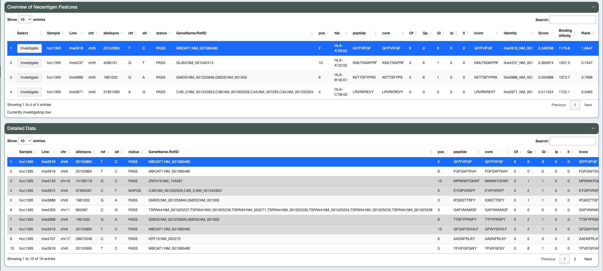

.. image:: ../../images/pVACview_logo_trans-bg_sm_v4b.png
    :align: right
    :alt: pVACview logo

.. _custom_features:

.. raw:: html

  
  

.. role:: large
.. role:: bold

Custom Features
---------------

The custom module has two tables: the top shows the groups of neoantigen and the second shows the detailed view of all neoantigens in 
that group, sorted by the specified feature. 

The custom module also has a dynamic scatter plot to explore and understand your dataset.
test 
