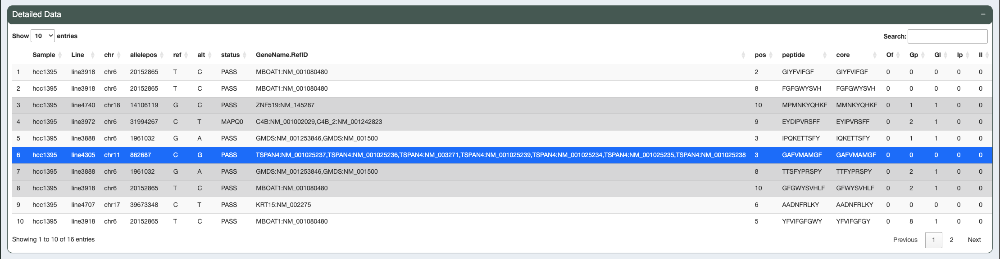

.. image:: ../../images/pVACview_logo_trans-bg_sm_v4b.png
    :align: right
    :alt: pVACview logo

.. _custom_features:

Custom Features
---------------

Overview of Neoantigen Features
_______________________________

The **Overview of Neantigen Features** table displays the groups of candidates as designated
by the feature specified by the user. The top candidate of the group according to the sort by feature
is shown in the table. To investiage the candidates within the group, click the ``Investigate`` button.

.. figure:: ../../images/screenshots/pvacview-custom-maintable-neopredpipe.png
            :width: 1000px
            :align: left
            :figclass: align-left

            Features grouped by HLA and sorted by binding affinity

Detailed Data
_____________

The **Detailed Data** table shows all the candidates within the group so that users can
compared them to one another. This table will only display the features that are
selected on the upload page.

            Features grouped by HLA and sorted by binding affinity

Dynamic Scatter Plot
____________________

The data can be further investigated by using the **Dynamic Scatter Plot** where users can choose any feature to be the X-axis, Y-axis,
color, or size variable. The X and Y scale can be transformed and a range of values subsetted. The color represents the minimum
and maximum values and can also be changed to any HEX value.

To view information about different points on the plot simply mouse over individual points. Users can export the current scatter plot
by using the camera icon at the top right corner of the plot.

