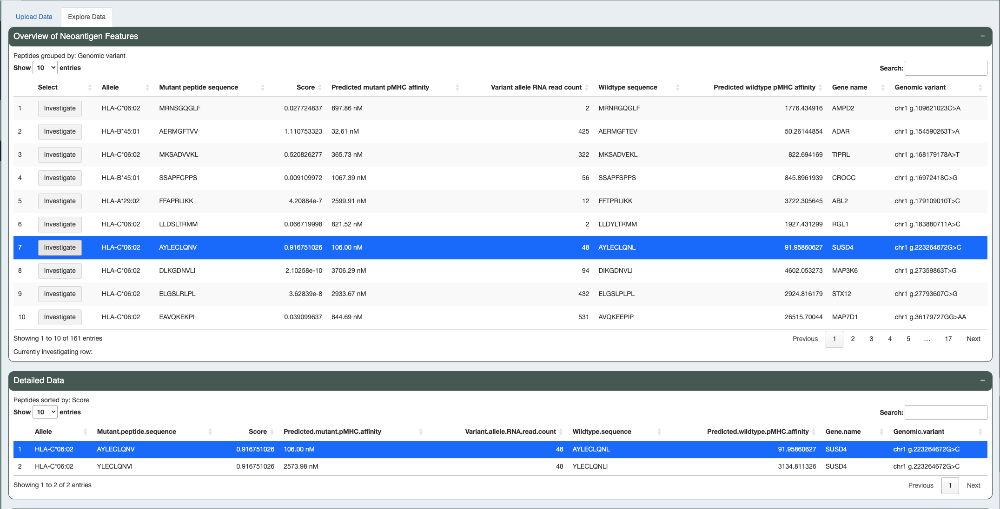

.. image:: ../../images/pVACview_logo_trans-bg_sm_v4b.png
    :align: right
    :alt: pVACview logo

.. _custom_upload:

Custom Upload
-------------

Upload
______

After successfully launching pVACview by completing the :ref:`prerequisites <pvacview_prerequisites>` section,
any neoantigen candidate data from a local directory can be uploaded in a tab-separated (tsv) file format.
When uploading the file, users can then choose how to visualize the data by selecting which feature
from the input they would like to use to group and sort candidates.

The feature chosen to group by
will allow users to explore candidates that are simliar to one another in a separate table. For example,
to mimic the pVACseq module, users could choose to group by variant.

The order of the candidates in each grouping is determined by the numeric feature chosen to sort by.
For example, candidates within the pVACseq module are sorted by tier.

Finally, users can select what features to display for each group of peptides.
The default selection is all features.

Visualize and Explore
_____________________

Upon choosing how to display your data, different aspects of the neoantigen candidates can be explored.

.. figure:: ../../images/screenshots/pvacview-custom-tables-vaxrank.png
    :width: 1000px
    :align: right
    :alt: pVACview Upload
    :figclass: align-left

There are three features that can be used to explore data:

- **Overview of Neoantigen Features**

  - Main table showcasing the top candidate of each grouping.

- **Detailed Data**

  - All candidates within the group being investigated ordered by the 'sort by' feature.

- **Dynamic Scatter Plot**

  - A scatter plot comparing multiple features simultaneously.
  - Users can change axis features, color feature, and size feature. Users can also transform the data with natural log, log2, log10, and square root, adjust data range, and set different colors for minimum and maximum.

Investigating Different Candidates
**********************************

To investigate a group of candidates, click the ``Investigate`` button in the appropriate row of the **Overview of Neoantigen Features** table.
The **Detailed Data** table will be updated with detailed data for that group of candidates.

All candidates can be explored together using the **Dynamic Scatter Plot**. To identify a candidate of interest from the scatter plot, simple mouse-over the point of interest for the specific information about that candidate to be shown.

.. figure:: ../../images/screenshots/pvacview-custom-dynamicscatter-vaxrank.png
    :width: 1000px
    :align: right
    :alt: pVACview Upload
    :figclass: align-left
