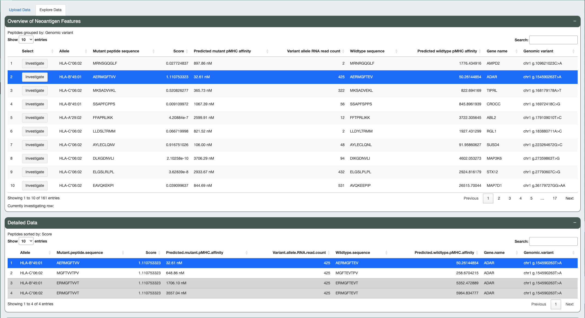

.. image:: ../../images/pVACview_logo_trans-bg_sm_v4b.png
    :align: right
    :alt: pVACview logo

.. _custom_upload:

.. raw:: html

  
  

.. role:: large
.. role:: bold

Custom Upload
---------------

:large:`Upload`
____________________________

Once you've successfully launched pVACview by completing the :ref:`prerequisites <pvacview_prerequisites>` section, 
you can now upload any neoantigen candidate data from your local directories to load in a tabular formmated (tsv) file. 

When you upload your file, you can then choose how to visualize the data by selecting which feature 
from your input you would like to group and sort candidates by. The feature you choose to group by
will allow you to explore candidates that are simliar to one another in a separate table. For example,
to mimic the pVACseq Module grouping you could select to group by variant. The order of the candidates
in each grouping is determined by the numeric feature you choose to sort by. Canidates within the pVACseq Module
are sorted by best binders. Finally, you can select what features to display for each group of peptides,
the defualt selection is all features. 

.. figure:: ../../images/screenshots/pvacview-custom-upload-vaxrank.png
    :width: 1000px
    :align: right
    :alt: pVACview Upload
    :figclass: align-left

:large:`Visualize and Explore`
______________________________

Upon choosing how you would like to display your data, you can now explore the different aspects of 
your neoantigen candidates.

There are three features that can be used to explore data:

- :bold:`Overview of Neoantigen Features`

  - Main table showcasing the top candidate of each grouping

- :bold:`Detailed Data`

  - all candidates within the group being investigated
  - ordered by the 'sort by' feature

- :bold:`Dynamic Scatter Plot`

  - A scatter plot comparing mutiple NeoFox features simultaneously
  - You can change axis features, color feature, and size feature. You can also transform the data with natural log, log2, log10, and square root, adjust data range, and set different colors for minimum and maximum.

Investigating Different Candidates
*********************************

To investigate a group of candidates, click investgate from the 'Overview of Neoantigen Features' table. 
Then the 'Detailed Data' table will be updated with that group of candidates.

.. figure:: ../../images/screenshots/pvacview-custom-investigate-vaxrank.png
    :width: 1000px
    :align: right
    :alt: pVACview Upload
    :figclass: align-left

You can explore all candidates together using the synamic scatter plot. To identify a candidates of interest from the scatter plot, simple curse-over the point of interest for the specific information about that candidate to be shown.

