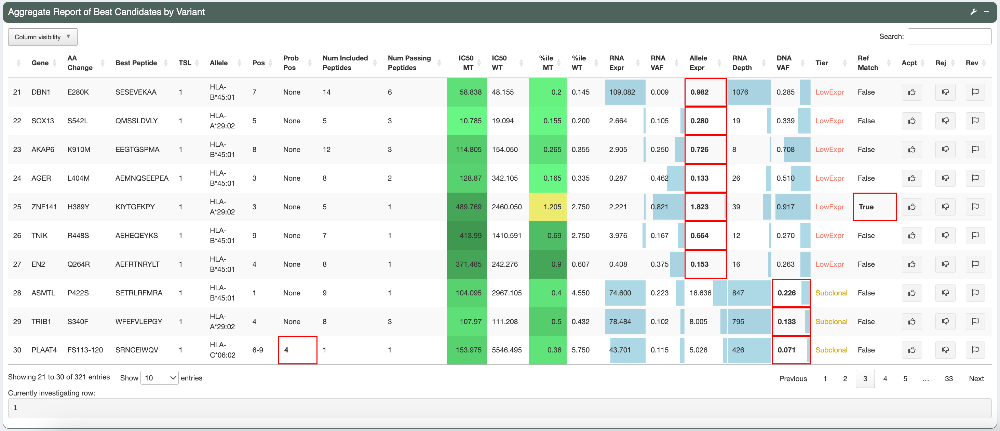
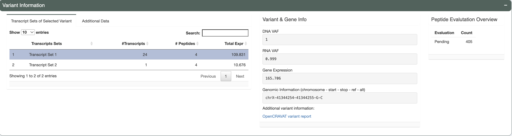
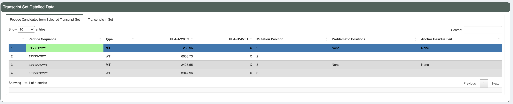

.. image:: ../images/pVACview_logo_trans-bg_sm_v4b.png
    :align: right
    :alt: pVACview logo

.. raw:: html

  
  

.. role:: large
.. role:: bold

.. _features_pvacview_label:

Features
---------------

When visualizing and exploring your neoantigen candidates, pVACview starts by providing an overview of all variants used to predict neoantigen candidates. You can then investigate each variant in
greater detail by breaking them down to the different transcripts that generate good-binding peptides. These transcripts then often each produce a different set of peptides that are predicted
to bind well to certain HLA alleles. The individual MT/WT peptides can be further explored in terms of the distribution of binding algorithm predictions as well as anchor locations. Here below, we walk through
the different sections of the pVACview explore page in detail.

:large:`Main aggregate report table`
_____________________________________

This is the aggregate report table generated as output from the pVACseq pipeline. The aggregate report summarizes the best-scoring epitope for each variant and outputs additional information specific to that epitope.
It also provides information on a high level, showing the total number of well-scoring epitopes for each variants and transcript that cover them. There is a tiering giving to each variant based on a set of evaluation rules,
helping you in prioritizing which variants to focus on first. Details on the report columns can be found :ref:`here <aggregated>`.

As shown, different cells of the report table are highlighted in various ways:

- :bold:`IC50 MT and %ile MT columns:`
    The IC50 MT and percentile MT columns represent the median predicted IC50 binding affinities and median predicted binding percentiles.
    Different colors are used to give a general idea of where predictions fall:

    - IC50 < 500nM and percentile < 0.5 colored with shades of green,
    - 500nM < IC50 < 1000nM and 0.5 < percentile < 2 colored with shades of orange,
    - IC50 > 1000nM and percentile > 2 colored with red.

- :bold:`RNA expression, RNA VAF, Allele Expr, RNA Depth, DNA VAF columns:`
    These columns have bar graphs as cell backgrounds to give an idea where specific values fall across the entire patient sample:

    - RNA VAF and DNA VAF columns range from 0 to 1
    - RNA Depth ranges from 0 to the max depth across all rows
    - RNA expression ranges from 0 to 50. This is done in order to highlight expression values that are in the lower range, based on the reasoning that, for neoantigen candidates, when the RNA expression reaches a certain level it is considered expressed without the need to specify how high the exact RNA expression value is.
    - Allele Expression ranges from 0 to max of RNA VAF column multiplied by 50 (which is the max for the RNA expression bar graph range).

- The ``Tier`` column is colored based on the specific cell value and red boxes across the row are used to highlight values that did not pass filters and resulted in the tier given.

For more details on what each column represent, you can hover over the column names and/or click the tool icon on the top right where ``Help`` documentation is located.

:large:`Transcripts, gene info and evaluation overview`
________________________________________________________

There are three separate boxes in this section as shown, from left to right you have:

- :bold:`Variant Information table`

  - Transcripts of selected mutation

    The selected variant may have multiple transcripts covering the region and those that produce good binding peptides against at least 1 HLA allele will be shown in this table. The table
    also provides the transcript expression values for all displayed transcripts. Based on which good binding peptides
    each transcript produces, the transcripts are grouped into different sets (e.g. if two transcripts produce the
    exact same peptides then they belong to the same set). The number of transcripts in each set, number of corresponding
    peptides and the total expression of all transcripts in set are calculated and provided.

  - Additional data

    The data displayed in this tab is dependent on the additional data file that you provided in the ``Upload`` page. The median IC50 value and median percentile values are shown if the app
    was able to locate the same variant in the data file provided. Values will show up as N/A if median IC50 or percentile values are not provided in the additional file.

- :bold:`Mutation & Gene information`

  This box displays the DNA VAF, RNA VAF, and gene expression values for the variant you have selected for investigation.
  The genomic information is provided in the format showing the chromosomal location of the variant for further variant analysis such as manual review.
  We also provide a link out to the variant report provided by `OpenCRAVAT <https://opencravat.org/>`_. This report will allow users to explore the variant with information regarding:
  variant annotation, cancer, population allele frequencies, clinical relevance, gene annotation, pathogenicity prediction etc.

- :bold:`Peptide Evaluation Overview`

  This box shows an overview of the current state of your evaluation choices (i.e. how many are marked accepted, rejected, or for review). Note that aggregate reports generated from the pvacseq pipeline defaults everything to ``Pending``.

:large:`Transcript Set Detailed Data (Peptide Information)`
___________________________________________________________

Upon selecting the transcript set for further examination, users can navigate to this table which displays
all peptide sequences (from your selected transcript set in the transcripts table) that were predicted to be good binders
(for at least 1 HLA allele). Both mutant (MT) and wildtype (WT) sequences
are shown, along with median binding affinities (where the MT binding passed the binding threshold).

We also provide (in the "Transcripts in Set" tab), additional information regarding the transcripts producing these peptides.
This includes: transcript id, individual transcript expression, `transcript support level <http://uswest.ensembl.org/info/genome/genebuild/transcript_quality_tags.html>`_, biotype and transcript length.

.. figure:: ../images/screenshots/pvacview-transcript_set.png
    :width: 1000px
    :height: 200px
    :align: right
    :alt: pVACview Upload
    :figclass: align-left

:large:`Additional information regarding individual algorithm binding and anchor scores`
__________________________________________________________________________________________

There's three different tabs in this section of the app, providing peptide-level details on the MT/WT peptide pair that you selected in the peptide table.

- :bold:`MHC binding prediction scores (IC50):`

  Shown in this tab are violin plots of the individual IC50-based binding affinity predictions of the MT and WT peptides for HLA alleles were the MT binds well to.
  These peptides each have up to 8 binding algorithm scores (for Class I alleles with pVACseq version 2.0) or up to 4 algorithm scores (for Class II alleles with pvacseq version 2.0).

|

  .. figure:: ../images/screenshots/pvacview-additional_info_1.png
      :width: 1000px
      :height: 350px
      :align: left
      :alt: pVACview Upload
      :figclass: align-left

- :bold:`MHC binding prediction scores (percentile):`

  Shown in this tab are violin plots of the individual percentile-based binding affinity predictions of the MT and WT peptides for HLA alleles were the MT binds well to.
  These peptides each have up to 8 binding algorithm scores (for Class I alleles with pVACseq version 2.0) or up to 4 algorithm scores (for Class II alleles with pvacseq version 2.0).

|

  .. figure:: ../images/screenshots/pvacview-additional_info_2.png
          :width: 1000px
          :height: 350px
          :align: left
          :figclass: align-left

- :bold:`Binding Affinity Table with IC50 and percentile values:`

  Here, we provide the specific IC50 and percentile binding affinity predictions generated from each individual algorithm.
  This data is specific to the MT/WT peptide pair selected in the peptide table.

|

  .. figure:: ../images/screenshots/pvacview-additional_info_3.png
              :width: 1000px
              :height: 250px
              :align: left
              :figclass: align-left

- :bold:`Allele-specific anchor prediction heatmap:`

  Previously, our lab has computationally predicted anchor positions for different hla alleles and peptide length combinations
  (`"Accurate neoantigen prediction depends on mutation position relative to patient allele-specific MHC anchor location" <https://www.biorxiv.org/content/10.1101/2020.12.08.416271v1>`_).
  These predictions are normalized probabilities representing the likelihood of each position of the peptide to participate in anchoring to the hla allele.
  Top 30 MT/WT peptide pairs from the peptide table are shown in this tab with anchor probabilities overlaying as a heatmap. These anchor probabilities shown are both allele and peptide length specific.
  The mutated amino acid(s) is/are marked in red (or the flanking ones are, in the case of deletions) and each MT/WT pair are separated from others using a dotted line.

|

  .. figure:: ../images/screenshots/pvacview-additional_info_4.png
              :width: 1000px
              :height: 350px
              :align: left
              :figclass: align-left
