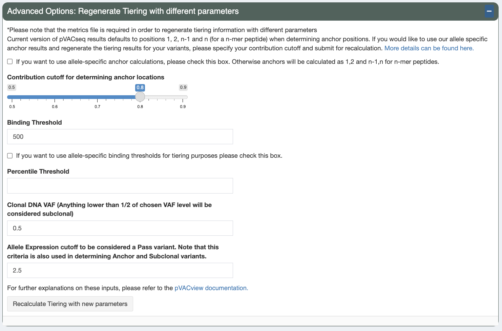
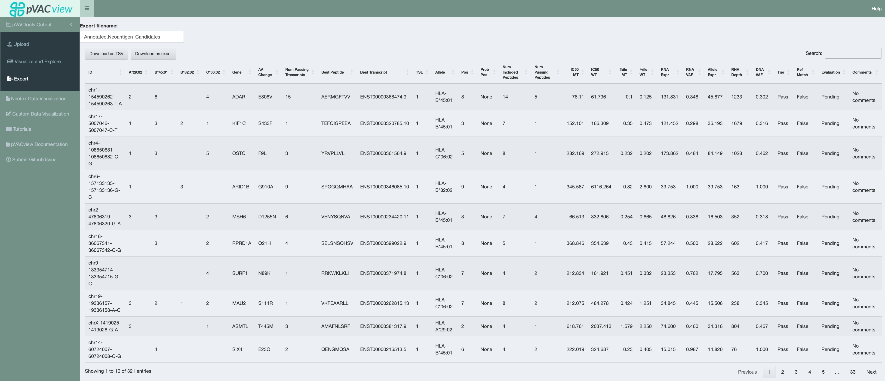

.. image:: ../images/pVACview_logo_trans-bg_sm_v4b.png
    :align: right
    :alt: pVACview logo

.. raw:: html

  
  

.. role:: large
.. role:: bold

Getting Started
---------------

The pVACview user interface has three pages: Upload, Visualize and Explore, and Export.

:large:`Upload`
____________________________

Once you've successfully launched pVACview by completing the :ref:`prerequisites <pvacview_prerequisites>` section, you can now upload your data by browsing through
your local directories to load in the aggregate report and metrics files, usually located in the same directory as your ``app.R`` file.
You will need to select the type of your files uploaded (Class I or Class II).

The two required inputs are ``SAMPLE_NAME.class_name.all_epitopes.aggregated.tsv`` and ``SAMPLE_NAME.class_name.all_epitopes.aggregated.metrics.json`` (these names may vary depending on your specific commands).
Both of which are output files from the pVACseq pipeline. The aggregated tsv file is a list of all predicted epitopes and their binding affinity scores,
with additional variant information and the metrics json file contains additional transcript and peptide level information that is needed for certain features
of the pVACview application. You can find further details on them :ref:`here <pvacseq_output_files>`.

You have the option of uploading an additional file to supplement the data you are exploring. This is useful in cases where you are visualizing Class I prediction data but would like to have
a general idea of the variant's Class II prediction performance or vice versa. In order to match your main data with data from your additional file, it is important that they were generated
from the same set of variants (but predicted for different HLA alleles). You will also want to specify whether the type of data you are adding was generated from Class I or Class II on the upload page by adding an appropriate label.

We also provide users with the opportunity of uploading a gene-of-interest tsv file, where each individual line consists of one gene name. If matched in the aggregate report, the gene name will be
highlighted using bold font and a green box around the cell.

.. figure:: ../images/screenshots/pvacview-upload.png
    :width: 1000px
    :height: 500px
    :align: right
    :alt: pVACview Upload
    :figclass: align-left

:large:`Visualize and Explore`
______________________________

Upon successfully uploading the matching data files, you can now explore the different aspects of your neoantigen candidates.

.. figure:: ../images/screenshots/pvacview-visualize_and_explore.png
    :width: 1000px
    :height: 400px
    :align: right
    :alt: pVACview Upload
    :figclass: align-left

Specifically, the features can be separated into three main categories:

- :bold:`Variant level information`

  - Main aggregate report table showcasing best candidates by variant
  - Mutation and Gene Info box

- :bold:`Transcript level information`

  - Transcripts of selected mutation that produces good binding peptides
  - Transcript Expression

- :bold:`Peptide level information`

  - All good binding peptides (for at least 1 HLA allele)
  - MHC binding prediction scores for each MT and WT peptide pair (IC50 and percentile)
  - Allele-specific anchor predictions

For detailed descriptions on individual sections, please refer to :ref:`features <features_pvacview_label>` page.

Additionally, you can regenerate the :ref:`Tiers <pvacseq_aggregate_report_tiers_label>` of variants by supplying a different set of variants:

- :bold:`Anchor contribution cutoff` (default: 0.8)

  This is the contribution cutoff for determining which positions of an HLA allele are categorized as anchors. Previously, our lab has computationally predicted anchor positions for different
  hla alleles and peptide length combinations (`"Accurate neoantigen prediction depends on mutation position relative to patient allele-specific MHC anchor location" <https://www.biorxiv.org/content/10.1101/2020.12.08.416271v1>`_).
  These predictions are normalized probabilities representing the likelihood of each position of the peptide to participate in anchoring to the hla allele. Upon the user specifying the contribution cutoff, the application calculates
  which positions will be included such that their probabilities add up to equal/more than the specified cutoff. (For example: if positions 2 and 9 have normalized probabilities of 0.4 and 0.5 and the user specified the cutoff to be 0.8
  , the anchors will be set as 2 and 9 for the specific peptide-HLA combination)

  Please note that you will need to check the box in order for this function to be used in calculation. If you wish to only change the other criteria (e.g. clonal vaf, allele expression) then please leave
  this box unchecked and proceed, your anchors will then remain as 1,2, and n-1, n for all n-mers.

- :bold:`Clonal variant VAF` (default: 0.5)

  This is the estimated DNA VAF of the clonal variant of the tumor. Variants with a DNA VAF less than half the specified number will be marked as subclonal.
  The aggregate report generated from the pVACseq pipeline (version 2.0) uses the maximum VAF under 0.6 as the clonal variant VAF. However, users may want to change this cutoff based on other genomic findings after
  closer analysis (e.g. VAF of driver mutations).

  As guidance, we provide the maximum VAF under 0.6 of the DNA VAF column of the aggregate report for reference. If you wish to keep the
  same cutoff, then please use the reference instead of the default which would be 0.5. Note that if you remove rows from the aggregate report, the number displayed might be influenced.

- :bold:`Allele Expression` (default: 3 and 1)

  Allele expression is calculated as gene expression * RNA VAF. This expression value is used as a cutoff in defining different Tiers for variants generating neoantigen candidates. The default allele
  expression cutoff for a variant to be considered a PASS variant is 3 and the cutoff is 1 for the variant to be considered as RELAXED. If the variant meets all other criteria but has an allele expression
  less than 1, then the variant is labeled as Low Expression. If the variant has an allele expression greater than 1, but fails the anchor criteria (mutation located an anchor with a strong binding WT peptide)
  then the variant is labeled as ANCHOR. Otherwise if the variant has an allele expression greater than 1, but fails the subclonal criteria (DNA VAF < 1/2 of the clonal VAF), then it is labeled as SUBCLONAL.
  More details can be found in the tooltip Help button on the top right of the aggreate report table.

  Here we provide users with the option of changing the high and low allele expression cutoffs to customize Tiering for their individual samples.

To investigate a specific variant in detail (on both the transcript and peptide levels), you will need to click on the investigate button located in the select column of the main aggregate report table (last column).
Afterwards, you may choose to select a rating for the neoantigen candidate using the Eval column. By default, all peptides are initially in a Pending state when the report is generated from pVACseq. Based on
exploration and evaluation of the features provided, you can mark the peptide as either ``Accept``, ``Reject``, or ``Review``. Your current state of selections are also counted and shown in the ``Peptide Evaluation Overview`` box.

.. figure:: ../images/screenshots/pvacview-comments.png
    :width: 800px
    :height: 200px
    :align: right
    :alt: pVACview Upload
    :figclass: align-left

Users can add comments to each line of variants they are investigating. These comments can be reviewed in the Export page
and will be in the final output (either tsv or excel) when downloaded. This column is by default ``N/A`` unless the input
aggregate report has a ``Comments`` column pre-specified.

:large:`Export`
____________________________

When you have either finished ranking your neoantigen candidates or need to pause and would like to save your current evaluations, you can export the current main aggregate report using the export page.
(If you are using R studio's default shiny app browser, you may run into the issue of not being able to properly export depending on your version. This is also why in the :ref:`prerequisites <launching_pvacview_label>` section,
we recommend launching the shiny app in a different web browser)

There are a couple things to note when exporting your current data:

- Export filename

  By default, your file will be named ``Annotated.Neoantigen_Candidates.tsv`` or ``Annotated.Neoantigen_Candidates.xsls``. You may want to modify this such that it is specific to your sample.

- Download as TSV/Excel

  We provide two download file types (tsv and excel). The excel format is user-friendly for downstream visualization and manipulation. However, if you plan on to continuing editing the aggregate report and would like to load
  it back in pVACview with the previous evaluations preloaded, you will need to download the file in a tsv format.

  :bold:`This serves as a way to save your progress as your evaluations are
  cleared upon closing or refreshing the pVACview app.`

