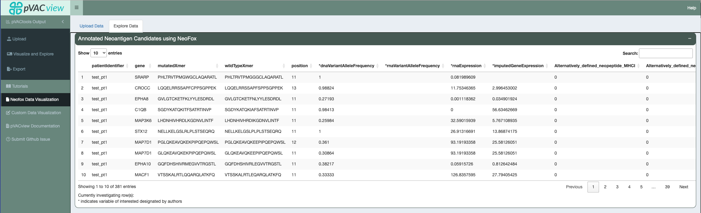
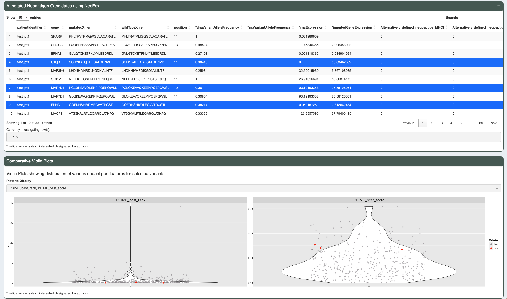
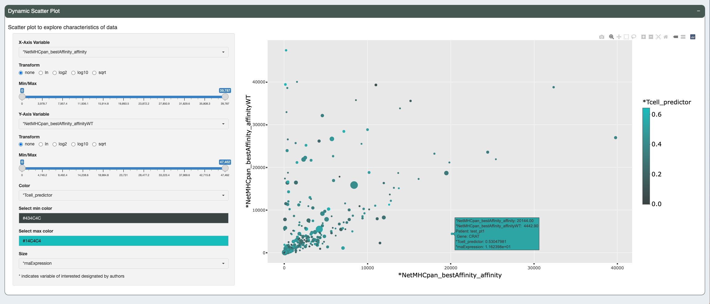

.. image:: ../../images/pVACview_logo_trans-bg_sm_v4b.png
    :align: right
    :alt: pVACview logo

.. _neofox_features:

.. raw:: html

  
  

.. role:: large
.. role:: bold

Neofox Features
---------------

:large:`Annotated Neoantigen Table`
_____________________________________

The annotated neoantigen table is generated as output from NeoFox and includes many annotations based on published neoantigen features. 
You can page through the candidates, sort by any feature, and select one or more candidates for further investgation. We have marked the 
features we find most informative with an asterick. 

:large:`Comparative Violin Plots`
_____________________________________

You can understand how selected candidates relate to the the rest of the dataset using the comparative violin plots. You can select as many candidates 
as you would like which will then be highlighted in red in the violin plots. You can also select up to six features to view at a time. We have pre-selected
five features which we found informative. 
 

:large:`Dynamic Scatter Plot`
_____________________________________

You can also further investigate the data using the dynamic scatter plot where you can choose any feature to be the X-axis, Y-axis,
color, or size variable. The X and Y scale can be transformed and a range of values subsetted. The color represents the minimum
and maximum values can also be changed to any HEX value. 

To view information about different points on the plot simply mouse over individual points. You can also export the current scatter plot 
by using the camera icon at the top right corner of the plot.

