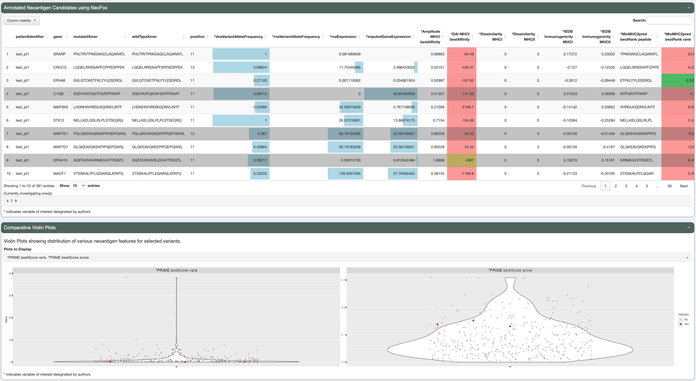

.. image:: ../../images/pVACview_logo_trans-bg_sm_v4b.png
    :align: right
    :alt: pVACview logo

.. _neofox_features:

Neofox Features
---------------

Annotated Neoantigen Candidates Table
_____________________________________

The **Annotated Neoantigen Candidates** table is generated as output from NeoFox and includes many annotations based on published neoantigen features.
Users can page through the candidates, sort by any feature, and select one or more candidates for further investgation. We have marked the
features we find most informative with an asterisk.

.. figure:: ../../images/screenshots/pvacview-neofox-maintable.png
    :width: 1000px
    :align: right
    :alt: pVACview Upload
    :figclass: align-left

Comparative Violin Plots
________________________

Users can investigate how selected candidates relate to the the rest of the dataset using the **Comparative Violin Plots**. Users can select as many candidates
as they would like which will then be highlighted in red in the violin plots. They can also select up to six features to view at a time. We have pre-selected
five features which we found informative.

Dynamic Scatter Plot
____________________

Users can further investigate the data using the **Dynamic Scatter Plot** where they can choose any feature to be the X-axis, Y-axis,
color, or size variable. The X and Y scale can be transformed and a range of values subsetted. The color represents the minimum
and maximum values and can be changed to any HEX value.

To view information about different points on the plot simply mouse over individual points. Users can export the current scatter plot
by using the camera icon at the top right corner of the plot.

