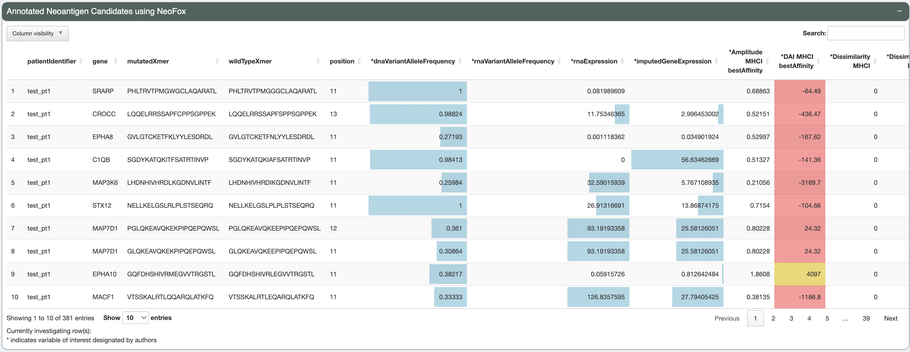

.. image:: ../../images/pVACview_logo_trans-bg_sm_v4b.png
    :align: right
    :alt: pVACview logo

.. _neofox_upload:

Usage
-----

Upload
______

After successfully launching pVACview by completing the :ref:`prerequisites <pvacview_prerequisites>` section, users can now upload their data by browsing through
local directories to load in a tab-separated (tsv) file generated by NeoFox.

The one required file should end with the suffix ``_neoantigen_candidates_annotated.tsv``.
The module expects all NeoFox annotated features to be in in the file but can also handle input files with additional annotations appended to the neoantigen candidates.

.. figure:: ../../images/screenshots/pvacview-neofox-upload.png
    :width: 1000px
    :align: right
    :alt: Screenshot of NeoFox module upload interface
    :figclass: align-left

Visualize and Explore
_____________________

Data
****

Upon successfully uploading the correct data file, users can now explore the different aspects of their neoantigen candidates.

There are three features that can be used to explore data:

- **Annotated Neoantigen Candidates Table**

  - Main table showcasing all candidates
  - Pre-selected columns of interest (denoted by an asterisk)
  - Colored heatmap and horizontal barplot cell backgrounds help quickly interpret the value of expression, VAF,
    binding affinity and rank columns
  - Evaluate candidates as accepted, rejected, or requiring further review

- **Comparative Violin Plots**

  - Up to six violin plots showcasing spread of any NeoFox feature
  - Pre-selected features are ones that we found most informative
  - Selected candidate are shown in red

- **Dynamic Scatter Plot**

  - A scatter plot comparing multiple NeoFox features simultaneously
  - Pre-selected features are ones that we found most informative
  - Users can change axis features, color feature, and size feature. They can also transform the data with natural log, log2, log10, and square root, adjust data range, and set different colors for minimum and maximum.

Investigating Different Variants
********************************

To investigate different candidates simple click one or more row from the **Annotated Neoantigen Candidates** table. The selected candidate(s) will be highlighted in red in the **Comparative Violin Plots**. Selecting a candidate does not affect the **Dynamic Scatter Plot**.

.. figure:: ../../images/screenshots/pvacview-neofox-violinplots_selected.png
    :width: 1000px
    :align: right
    :alt: Screenshot of NeoFox module violin plot
    :figclass: align-left

Users can explore all candidates together using the **Dynamic Scatter Plot**. To identify a candidates of interest from the scatter plot, simple mouse-over the point of interest for the specific information about that candidate to be shown.

.. figure:: ../../images/screenshots/pvacview-neofox-dynamicscatterplot_selected.png
    :width: 1000px
    :align: right
    :alt: Screenshot NeoFox module dynamic scatter plot
    :figclass: align-left

Evaluating and Commenting
*************************

The evaluation buttons at the right of each candidate row can be used to capture the final decision on whether to
accept, reject, or further review the candidate. The total counts for each type of evaluation are displayed in the
"Peptide Evaluation Overview" panel.

Users are able to leave a comment on all selected candidates by using the form in the panel on the top right of the
page. This panel also displays the comments left on each selected candidate. Both the selected evaluation and
comment are included in the exported table."),

Export
______

After investigating and evaluating each candidate, users can export the main table, including the final evaluation
and comment for each candidate. After browsing to the "Export Data" tab, clicking the "Download as TSV" or "Download
as excel" button will download the table in the desired file format."

