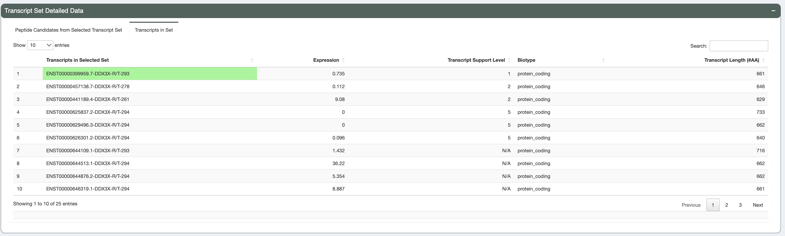

.. image:: ../../images/pVACview_logo_trans-bg_sm_v4b.png
    :align: right
    :alt: pVACview logo

.. raw:: html

  
  

.. role:: large
.. role:: bold

.. _features_pvacview_label:

Features
---------------

When visualizing and exploring your neoantigen candidates, pVACview starts by providing an overview of all variants used to predict neoantigens. You can then investigate each variant in
greater detail by viewing the different transcripts that generate good-binding peptides. Each transcript may, in turn, produce a set of multiple peptides that are predicted to bind well to certain HLA alleles, and these are visualized as well. The individual mutant (MT) and wild-type (WT) peptides can be further explored through plots showing the distribution of binding algorithm predictions as well as anchor locations. Below, we walk through the different sections of the pVACview explore page in detail.

:large:`Main aggregate report table`
_____________________________________

This table is generated directly as output from the pVACseq pipeline. The aggregate report summarizes the best-scoring epitope for each variant and shows details specific to that epitope.
It also provides summary information, including the total number of well-scoring epitopes for each variant and the numbers of transcripts to which they are annotated. Tiering classifies variants based on factors believed to influence the quality of a neoantigen candidate, helping to prioritize which variants to focus on first. :ref: `Details on the report columns can be found in the pvactools documentation <aggregated>`.

Highlighting and color are used to make understanding neoantigen features intuitive:

- :bold:`IC50 MT and %ile (percentile) MT columns:`
    The IC50 MT and %ile MT columns represent the predicted IC50 binding affinities and predicted binding percentile ranks. Whether these columns contain the median across all algorithms or lowest (best) scores depends on the value set for ``--top-score-metric`` in the
    original pVACseq run. Colors are used to give a general idea of where predictions fall in relation to the predefined thresholds:

    - Green:  IC50 MT < binding threshold and %ile MT < percentile threshold 
    - Yellow/Orange: binding threshold < IC50 MT < (2 * binding threshold) and percentile threshold < %ile MT < (2 * percentile threshold) 
    - Red: IC50 MT > (2 * binding threshold) and %ile MT > (2 * percentile
      threshold)

- :bold:`RNA expression, RNA VAF, Allele Expr, RNA Depth, DNA VAF columns:`
    These columns have bar graphs as cell backgrounds representing where specific values fall across all neoantigens in the entire patient sample:

    - RNA VAF and DNA VAF columns range from 0 to 1
    - RNA Depth ranges from 0 to the max depth across all rows
    - RNA expression ranges from 0 to 50. Anything above 50 is simply displayed as 50, to prevent extremes from stretching the scale and obscuring lower expression values.
    - Allele Expression (which is RNA VAF * RNA expression) ranges from 0 to the max of RNA VAF column multiplied by 50 (which is the max for the RNA expression bar graph range).

- The ``Tier`` column is colored based on the specific cell value and red boxes across the row are used to highlight values that did not pass filters and resulted in the tier given.

For more details on what each column represent, you can hover over the column names and/or click the tool icon on the top right where ``Help`` documentation is located.

.. figure:: ../../images/screenshots/pvacview-main_table.png
    :width: 1000px
    :align: right
    :figclass: align-left

:large:`Variant Information (Transcripts, gene info and evaluation overview)`
_____________________________________________________________________________

There are three separate boxes in this section as shown. From left to right:

- :bold:`Variant Information tabs`

  - Transcript Sets of Selected Variant

    The selected variant may have multiple transcripts covering the region. However, some transcripts might code for the
    same set of neoantigen candidates if the difference between transcripts is not proximal to the
    somatic mutation of interest. This table groups transcripts that produce identical peptides and shows the number of transcripts in each set, the number of corresponding peptides and the total expression of all transcripts in the set.

  - Reference Matches

    If the reference proteome similarity feature was enabled during the
    original pVACseq run, this tab will show results for the Best Peptide, the larger peptide
    sequence around the Best Peptide that was queried for, and any matches to the reference proteome  
    that were identified

  - Additional data

    The data displayed in this tab is user-configurable, and shows info from any "additional data files" provided on the ``Upload`` page. The IC50 MT value and %ile MT values are shown if the app
    was able to locate the same variant in the data file provided. Values will show up as N/A if IC50 MT or %ile MT values are not provided in the additional file. Additionaly, the Best Peptide of the variant from that file will be listed as well as the HLA Allele, the Best Peptide prediction, and the Best Transcript for the prediction.

- :bold:`Variant & Gene Info`

  This box displays the DNA VAF, RNA VAF, and gene expression values for the variant you have selected for investigation.
  The genomic coordinates of the variant are provided to ease in analyses such as manual review.
  We also provide a link out to the variant report provided by `OpenCRAVAT <https://opencravat.org/>`_. This report will allow users to retrieve variant information including the gene annotation, cancer involvement, population allele frequencies, clinical relevance, and pathogenicity predictions

- :bold:`Peptide Evaluation Overview`

  This box shows an overview of the current state of your evaluation choices (i.e. how many are marked accepted, rejected, or for review). In reports generated from the pvacseq pipeline, every site defaults to ``Pending``.

.. figure:: ../../images/screenshots/pvacview-middle_section.png
    :width: 1000px
    :align: right
    :alt: pVACview Upload
    :figclass: align-left

:large:`Transcript Set Detailed Data (Peptide Information)`
___________________________________________________________

Upon selecting the transcript set for further examination, this table displays
all peptide sequences from the selected transcript set that are predicted to be good binders
for at least 1 HLA allele. Both mutant (MT) and wildtype (WT) sequences
are shown, along with binding affinities (where the MT binding passed the binding threshold). As above, whether this table shows mutant or lowest binding affinities depends on the value of the ``--top-score-metrics`` parameter from the original pVACseq run.

For each peptide, this table also shows whether there are any problematic
positions and whether or not the peptide fails the anchor residue criteria
for any of the HLA alleles. Peptides failing these criteria are deprioritized
in the sorting of this table.

.. figure:: ../../images/screenshots/pvacview-peptide_table.png
    :width: 1000px
    :align: right
    :alt: pVACview Upload
    :figclass: align-left

In the "Transcripts in Set" tab, we also provide additional information regarding the transcripts producing these peptides.
This includes: transcript id, individual transcript expression, `transcript support level <http://uswest.ensembl.org/info/genome/genebuild/transcript_quality_tags.html>`_, biotype and transcript length. Transcripts with a protein_coding biotype, low TSL and long length
are prioritized in the sorting of this table.

:large:`Additional Peptide Information (Additional information regarding individual algorithm binding and anchor scores)`
_________________________________________________________________________________________________________________________

There are five different tabs in this section of the app, providing peptide-level details on the MT/WT peptide pair that you selected in the peptide table.

- :bold:`IC50 Plot:`

  Shows violin plots of the individual IC50-based binding affinity predictions of the MT and WT peptides. Only HLA alleles with good mutant-peptide binding are displayed.
  Each point represents the scores for a particular Class I or Class II binding algorithm.

  .. figure:: ../../images/screenshots/pvacview-additional_info_1.png
      :width: 1000px
      :align: center
      :alt: pVACview Upload
      

- :bold:`%ile Plot:`

  Shows violin plots of the individual percentile-based binding affinity predictions of the MT and WT peptides. Only HLA alleles with good mutant-peptide binding are displayed.
  Each point represents the scores for a particular Class I or Class II binding algorithm.

  .. figure:: ../../images/screenshots/pvacview-additional_info_2.png
      :width: 1000px
      :align: center
 

- :bold:`Binding Data:`

  Shows the specific IC50 and percentile binding affinity predictions generated from each individual algorithm. This data is specific to the MT/WT peptide pair selected in the peptide table.

  .. figure:: ../../images/screenshots/pvacview-additional_info_3.png
      :width: 1000px
      :align: center
              

- :bold:`Elution Data:`

  Shows the specific elution scores and percentiles generated from each individual algorithm.
  This data is specific to the MT/WT peptide pair selected in the peptide table.

  .. figure:: ../../images/screenshots/pvacview-additional_info_4.png
      :width: 1000px
      :align: center
     

- :bold:`Allele-specific anchor prediction heatmap:`

  Our lab has computationally predicted anchor positions for different hla alleles and peptide length combinations
  (`"Computational prediction of MHC anchor locations guides neoantigen identification and prioritization" <https://www.science.org/doi/10.1126/sciimmunol.abg2200?url_ver=Z39.88-2003&rfr_id=ori:rid:crossref.org&rfr_dat=cr_pub%20%200pubmed>`_).
  These predictions are normalized probabilities representing the likelihood of each position of the peptide to participate in anchoring to the hla allele. The top 30 MT/WT peptide pairs from the peptide table are shown in this tab with anchor probabilities overlayed as a heatmap. These anchor probabilities shown are both allele and peptide length specific.
  The mutated amino acid(s) are marked in red (or the flanking ones are, in the case of deletions) and each MT/WT pair are separated from others using a dotted line.

  .. figure:: ../../images/screenshots/pvacview-additional_info_5.png
      :width: 1000px
      :align: center

