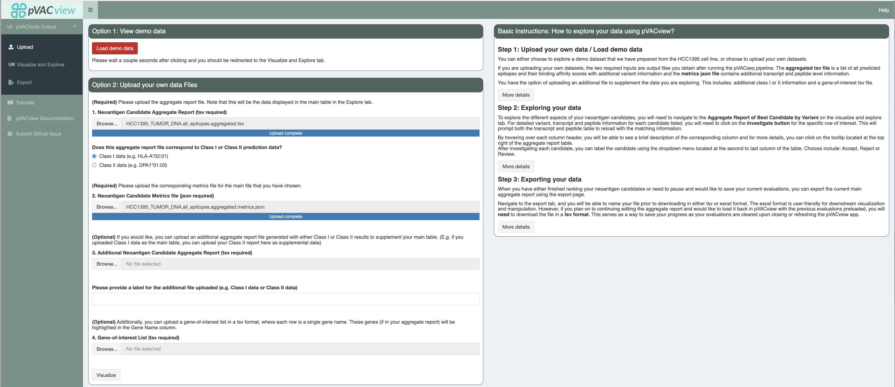
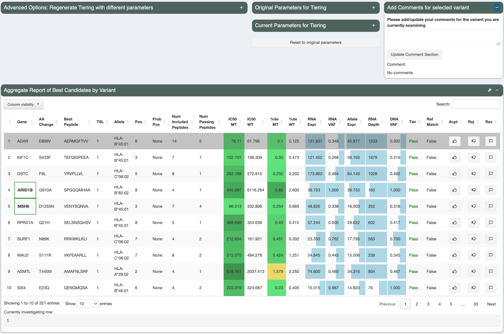

.. image:: ../../images/pVACview_logo_trans-bg_sm_v4b.png
    :align: right
    :alt: pVACview logo

.. raw:: html

  
  

.. role:: large
.. role:: bold

Upload
---------------

The pVACview user interface has four sections:

- pVACtools Output, where pVACseq results can be uploaded, visualized/explored, and exported
- Tutorials, where the pVACview app is documented in more detail
- pVACview Documentation, which is a link to the documentation here
- Submit GitHub Issue, which is a link to GitHub to submit bug reports and
  additional questions

:large:`Upload`
____________________________

Once pVACview has been successfully launched by completing the :ref:`prerequisites <pvacview_prerequisites>` section, data can now be uploaded to view. 

The two required inputs are ``<sample_name>.all_epitopes.aggregated.tsv`` and ``<sample_name>.all_epitopes.aggregated.metrics.json``), both of which are output files from the pVACseq pipeline. Both are typically located in your local directories in the same folder as the ``app.R`` file. When uploading, you will need to select the type of your files uploaded (Class I or Class II).

The aggregated tsv file is a list of all predicted epitopes and their binding affinity scores,
with additional variant information. The metrics json file contains additional transcript and peptide level information that is needed for certain features of the pVACview application. You can find further details on them :ref:`in the pvacseq output files documentation <pvacseq_output_files>`.

You also have the option of uploading an additional file to supplement the data you are exploring. A typical use case is when you are visualizing Class I prediction data, but would sometimes like to view general Class II prediction scores, or vice versa. In order to match your main data with data from your additional file, it is important that they were generated
from the same set of variants (but predicted for different HLA alleles). You will also want to specify whether the type of data you are adding was generated from Class I or Class II on the upload page by selecting the appropriate radio button option.

You can also provide a gene-of-interest tsv file, where each individual line consists of one gene name. If matched in the aggregate report, the gene name will be
highlighted using bold font and a green box around the cell.

:large:`Visualize and Explore`
______________________________

Data
****

Upon successfully uploading the matching data files, you can now explore the different aspects of your neoantigen candidates.

Specifically, the features can be separated into five categories:

- :bold:`Variant level information`

  - The main aggregate report table showcasing best candidates by variant

- :bold:`Selected Variant detail information`

  - The transcript sets for a selected variant in the main aggregate report table 
    (where all transcripts in the set code for the same set of neoantigen
    candidates). The transcript set that includes the best transcript is
    highlighted in green and selected by default.
  - Reference proteome match details for the selected variant (if reference
    protome similarity feature was originally run)
  - Additional Data for the selected variant (when a Additional Neoantigen Candidate Aggregate Report was uploaded)
  - Variant & Gene Info box with VAF and expression information for the
    selected variant

- :bold:`Selected Transcript Set information`

  - Transcripts of selected set that produce good binding peptides
  - Expression, transcript support level, and biotype information etc. of the
    transcripts in the set

- :bold:`Selected Transcript Set Peptide information`

  - All well-binding peptides (for at least 1 HLA allele) in the selected
    transcript set. The best peptide is highlighted in green.
  - MHC binding prediction scores for each MT and WT peptide pair
  - Allele-specific anchor prediction heatmap and per-position and per-allele anchor weights

- :bold:`Selected Peptide information`

  - Per-algorithm and HLA-allele MHC binding predictions for the selected peptide and its
    matched WT sequence (IC50 and Percentile)
  - Violin plot for the IC50 and Percentile predictions
  - Elution and immunogenicity data for the selected peptide and its matched WT sequence

For detailed descriptions on individual sections, please refer to :ref:`features <features_pvacview_label>` page.

Regenerate Tiering
******************

The :ref:`Tiering <pvacseq_aggregate_report_tiers_label>` of variants can be adjusted without re-running pVACseq by supplying a different set of parameter cutoffs, then pressing the ``Recalculate Tiering with new paramters`` button:

- :bold:`Allele-specific anchor calculations`

  Check this box to turn on allele-specific anchor calculations. If this
  option is unchecked, the following positions will be considered anchor
  positions: 1, 2, n-1, and n (where n is the length of the peptide)

- :bold:`Anchor contribution cutoff`

  When the "allele-specific anchor calculations" option is chosen, this is the contribution cutoff for determining which positions of an HLA allele are categorized as anchors. Previously, our lab has computationally predicted anchor positions for different
  hla alleles and peptide length combinations (`"Accurate neoantigen prediction depends on mutation position relative to patient allele-specific MHC anchor location" <https://www.biorxiv.org/content/10.1101/2020.12.08.416271v1>`_).
  These predictions are normalized probabilities representing the likelihood of each position of the peptide to participate in anchoring to the HLA allele. Upon the user specifying the contribution cutoff, the application calculates
  which positions will be included such that their probabilities add up to equal/more than the specified cutoff. (For example: if positions 2 and 9 have normalized probabilities of 0.4 and 0.5 and the user specified the cutoff to be 0.8
  , the anchors will be set as 2 and 9 for the specific peptide-HLA combination)

- :bold:`Binding Threshold`

  The threshold to consider a peptide a good binder. IC50 MT binding below this value will be considered.

- :bold:`Allele-specific binding thresholds`

  When this box is checked, use allele-specific binding thresholds, as defined
  by `IEDB
  <https://help.iedb.org/hc/en-us/articles/114094151811-Selecting-thresholds-cut-offs-for-MHC-class-I-and-II-binding-predictions>`_,
  instead of the binding threshold set above. For alleles where a specific
  threshold is not defined in IEDB, the binding threshold set above is used as a fallback.

- :bold:`Percentile Threshold`

  In addition to passing the binding affinity IC50 threshold above, the %ile MT will
  also need to be below this value in order for the peptide to be considered a
  good binder.

- :bold:`Clonal variant VAF`

  This is the estimated DNA VAF of the clonal variant of the tumor. Variants with a DNA VAF less than half the specified number will be marked as subclonal. For a 100% pure tumor, heterozygous variants are expected to be present at 50% VAF, and anything below 25% VAF would be marked as potentially subclonal. 

- :bold:`Allele Expression`

  Allele expression is calculated as gene expression * RNA VAF and represents the total amount of the mRNA transcript that is present in the sample. Variants with allele expression above this cutoff will be considered well-expressed.

.. figure:: ../../images/screenshots/pvacview-regenerate_tier.png
    :width: 1000px
    :align: right
    :alt: pVACview Upload
    :figclass: align-left

These parameters will default to the value used in your original pVACseq run.
After adjusting and retiering your candidates, the adjusted paramters will then be displated in the ``Current Parameters for Tiering`` section.
The parameters originally used for tiering are displayed in the ``Original
Parameters for Tiering`` section. You can reset the tiers to the parameters
used originally by clicking the ``Reset to original paramters`` button.

Investigating Different Variants
********************************

To investigate a specific variant in detail (on both the transcript and peptide levels), you will need to click on the investigate button located in the select column of the main aggregate report table (last column).
Afterwards, you may choose to select a rating for the neoantigen candidate using the Eval column. By default, all peptides are initially in a "Pending" state when the report is generated from pVACseq. Based on
exploration and evaluation of the features provided, you can mark the peptide as either ``Accept``, ``Reject``, or ``Review``. Counts of the current states are shown in the ``Peptide Evaluation Overview`` box.

.. figure:: ../../images/screenshots/pvacview-comments.png
    :width: 800px
    :align: right
    :alt: pVACview Upload
    :figclass: align-left

Users can add comments to each line of variants they are investigating. These comments can be reviewed in the Export page
and will be in the final output (either tsv or excel) when downloaded. This column is by default ``N/A`` unless the input
aggregate report has a ``Comments`` column pre-specified.

:large:`Export`
____________________________

When you have either finished ranking your neoantigen candidates or need to pause and would like to save your current evaluations, you can export the current main aggregate report using the export page.
(! Note: If you run the app using the default RStudio browser, exports may not work correctly.  We highly recommend launching the application in a different web browser, as described in the :ref:`prerequisites <launching_pvacview_label> section`.

There are a couple things to note when exporting your current data:

- Export filename

  By default, your file will be named ``Annotated.Neoantigen_Candidates.tsv`` or ``Annotated.Neoantigen_Candidates.xsls``. You may want to modify this such that it is specific to your sample.

- Download as TSV/Excel

  We provide two download file types (tsv and excel). The excel format is user-friendly for downstream visualization and manipulation. However, if you plan on to continuing editing the aggregate report and would like to load
  it back in pVACview with the previous evaluations preloaded, you will need to download the file in a tsv format.

  :bold:`This serves as a way to save your progress as your evaluations are
  cleared upon closing or refreshing the pVACview app.`

.. figure:: ../../images/screenshots/pvacview-export.png
      :width: 1000px
      :align: right
      :alt: pVACview Upload
      :figclass: align-left
