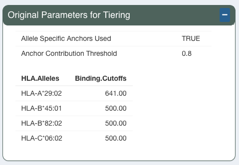
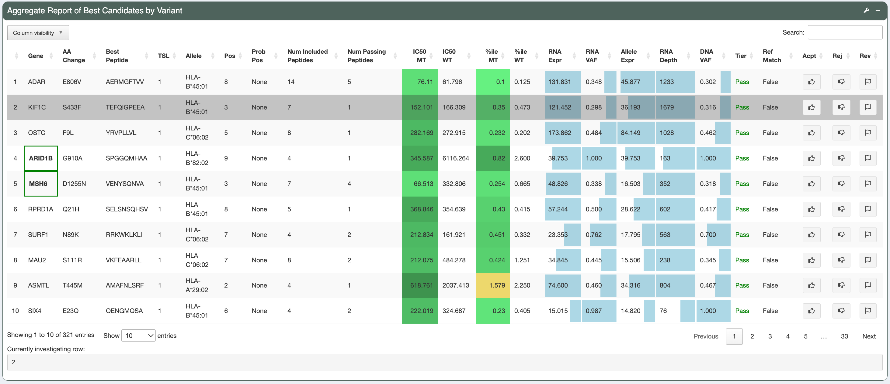
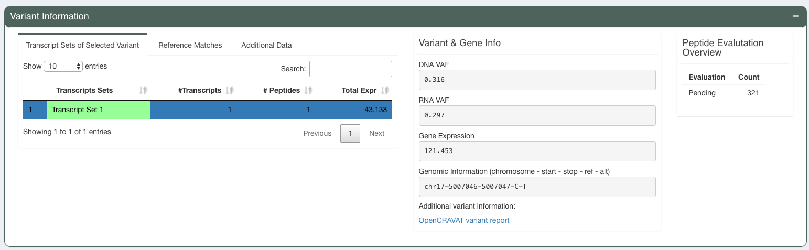
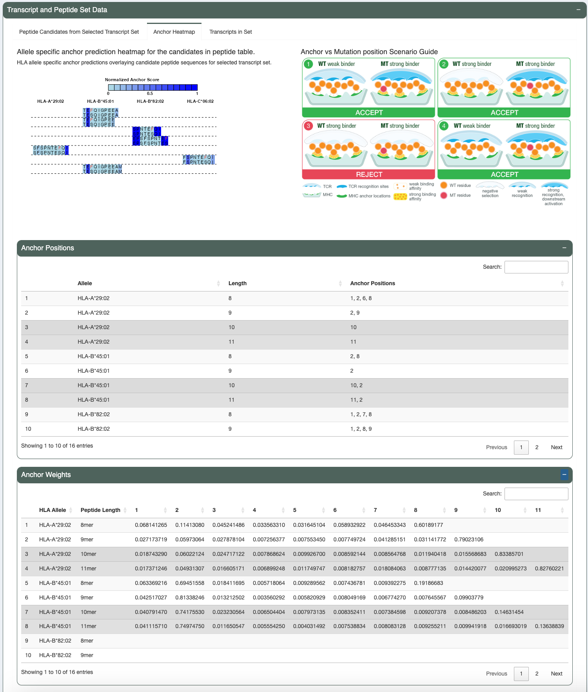
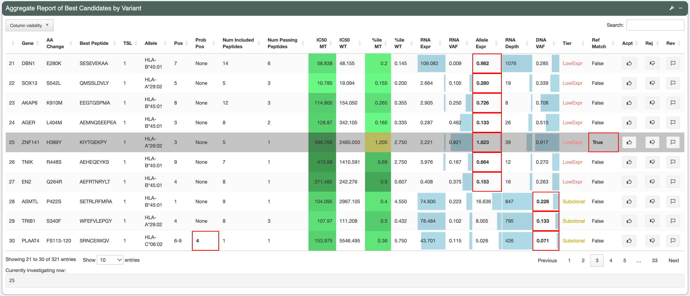

.. image:: ../../images/pVACview_logo_trans-bg_sm_v4b.png
    :align: right
    :alt: pVACview logo

.. raw:: html

  
  

.. role:: large
.. role:: bold

Vignette
---------------
In this vignette, we will demonstrate evaluation of neoantigen candidates predicted by pVACseq with pVACview using the built-in demo data. The demonstration dataset includes Class I and Class II neoantigen candidate files generated from the HCC1395 breast cancer cell line and its matched lymphoblastoid cell line HCC1395BL. You can also download the demo data `here <https://github.com/griffithlab/pVACtools/tree/master/pvactools/tools/pvacview/data>`_. 

:large:`Upload`
____________________________

First, navigate to the Upload page, and click on ``Load demo data``.
This will immediately load:

- A tsv of Class I data
- A json file of Class I data
- An additional tsv for Class II data
- A list of genes of interest (cancer census hotspot gene list tsv)

and take you to the 'Visualize and Explore' page. 

.. figure:: ../../images/screenshots/vignette/pvacview-loadDemoDataset.png
    :width: 1000px
    :align: right
    :alt: pVACview Vignette
    :figclass: align-left

:large:`Visualize and Explore`
______________________________

You will next be taken to a view similar to this.

The top row of the page has 3 sections: 

- Advanced Options: Regenerate Tiering with different parameters
- Original Parameters for Tiering
- Add Comments for selected variant

The second row of the page has 1 section named ``Aggregate Report of Best Candidates by Variant``, which lists all neoantigen candidates in provided input. Candidates with higher Tier (Tier ``Pass``) will be shown first, followed by candidates of lower Tiers (Tier ``Low Expr``, ``Subclonal``, ``Poor``, ``NoExpr``). Genes that match with the user-input list of genes of interest will have a green box around them (for example, ARID1B and MSH6 are covered by a green box in this demo). 

You can also set your own Tier-setting parameters by expanding ( clicking the ``+`` button on)  ``Advanced Options: Regenerate Tiering with different parameters``.

.. figure:: ../../images/screenshots/vignette/pvacview-advancedOption.png
    :width: 1000px
    :align: right
    :alt: pVACview Vignette
    :figclass: align-left

Here, we will use the original parameters to explore the dataset. 
The original parameters have ``VAF Clonal`` set at 0.5. ``VAF Subclonal`` is automatically calculated as half of ``VAF Clonal``, and is therefore set at 0.25.
The ``Allele Expression for Passing Variants`` is set at 2. ``Binding Threshold`` is 500 nM . ``Binding Threshold for Inclusion Into Metric File`` is 5000. ``Anchor Contribution Threshold`` is 0.8. The ``HLA.Alleles`` and respective ``Binding.Cutoffs`` are also displayed. 

.. rst-class:: three-images-row

.. image:: ../../images/screenshots/vignette/originalParametersForTiering/pvacview-OG_params_2.png
   :width: 45%
   :align: center
   :alt: pVACview Vignette

   To investigate a desired candidate, users will click on the ``Investigate`` button on the right side of the row for that candidate. The currently investigated candidate will be framed in blue.

Example 1: a good candidate: KIF1C-S433F: TEFQIGPEEA
^^^^^^^^ 

**Variant-level assessment:**

The variant has good DNA and RNA VAF (the DNA VAF is higher than the Subclonal threshold of 0.25) . 

In this case, there’s only 1 mutant transcript matches with the user-provided RNAseq data (``Transcript Sets of Selected Variant`` tab shows only 1 result).

The predicted best peptide (neoantigen candidate) doesn’t have any match in the human genome. This is ideal, since the candidate will more likely to be recognized by Tcells.

**Transcript-level assessment:**

The variant is detected in only 1 transcript. This transcript has good expression and Transcript Support Level. 

.. figure:: ../../images/screenshots/vignette/KIF1C-new/KIF1C_6_TranscriptsInSet.png
    :width: 1000px
    :align: right
    :alt: pVACview Vignette
    :figclass: align-left

You can see the mutant (MT) and wildtype (WT) peptide sequence for this transcript side-by-side.

.. figure:: ../../images/screenshots/vignette/KIF1C-new/KIF1C_4_PeptidesTranscriptSet.png
    :width: 1000px
    :align: right
    :alt: pVACview Vignette
    :figclass: align-left

**Protein-level assessment:**

The candidate in investigation has good binding affinity (median IC50 score is less than 500nM, percentile rank is less than 2%). Elution score varies with algorithms but overall the mutant peptide has better elution score than wildtype peptide, and the elution score is close to 1. 

.. figure:: ../../images/screenshots/vignette/KIF1C-new/KIF1C_7_IC50plot.png
    :width: 1000px
    :align: right
    :alt: pVACview Vignette
    :figclass: align-left

.. figure:: ../../images/screenshots/vignette/KIF1C-new/KIF1C_9_BindingData.png
    :width: 1000px
    :align: right
    :alt: pVACview Vignette
    :figclass: align-left

The mutation is not in an anchor position (see ``Anchor heatmap`` tab). Anchor prediction scores for each amino acid position are provided in ``Anchor Weights`` tab at the bottom. 
Both mutant and wildtype peptides are good binders, yet the mutant peptide is a stronger binder. This is scenario number 2 (WT strong binder, MT strong binder, MT not in an anchor position) according to the Scenario Guide, where the neoantigen candidate is favorable and can be accepted. 

Beside Class-I peptide, the best predicted Class-II peptide from user-input can also be reviewed, using the ``Additional data`` tab.  

.. figure:: ../../images/screenshots/vignette/KIF1C-new/KIF1C_3_AdditionalData.png
    :width: 1000px
    :align: right
    :alt: pVACview Vignette
    :figclass: align-left

**Decision:**

Given all the information above, we can conclude that the reviewed Class I peptide is potentially a good binder and choose to Accept this candidate in the ``Eval`` drop-down menu. 

.. figure:: ../../images/screenshots/vignette/KIF1C-new/KIF1C_11_Decision_1.png
    :width: 1000px
    :align: right
    :alt: pVACview Vignette
    :figclass: align-left

.. figure:: ../../images/screenshots/vignette/KIF1C-new/KIF1C_11_Decision_2.png
    :width: 1000px
    :align: right
    :alt: pVACview Vignette
    :figclass: align-left

Example 2: a bad candidate: ZNF141-H389Y: KIYTGEKPY
^^^^^^^^ 

**Variant-level assessment:**

Given that the allele expression for passing variants is set at 2.5 (and a lot of gene has allele expression in the range of 5-114), ``Allele expression`` of this ZNF141 variant is low (1.824). 

Furthermore, the candidate peptide KIYTGEKPY matches with a sequence in the human reference proteome. 

.. figure:: ../../images/screenshots/vignette/ZNF141/2_ReferenceMatches.png
    :width: 1000px
    :align: right
    :alt: pVACview Vignette
    :figclass: align-left

These potentially problematic characteristics are also flagged by the red boxes at the ``Aggregate report of best candidate by variant`` section.

**Decision:**

Since the candidate peptide has a match in the reference proteome, we will reject this candidate. 

:large:`Export`
____________________________

After reviewing candidates, you can download the file with evaluation as a tsv or as an excel sheet. 

.. figure:: ../../images/screenshots/vignette/pvacview-export.png
    :width: 1000px
    :align: right
    :alt: pVACview Vignette
    :figclass: align-left

