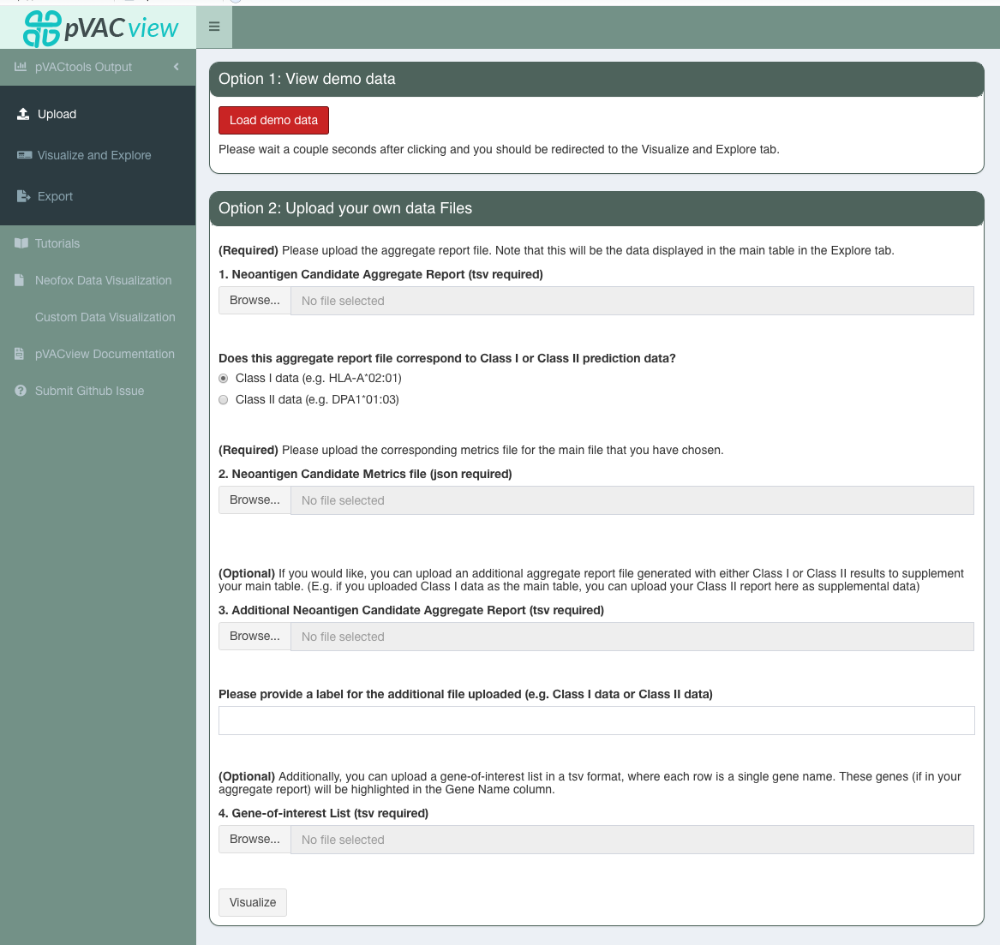
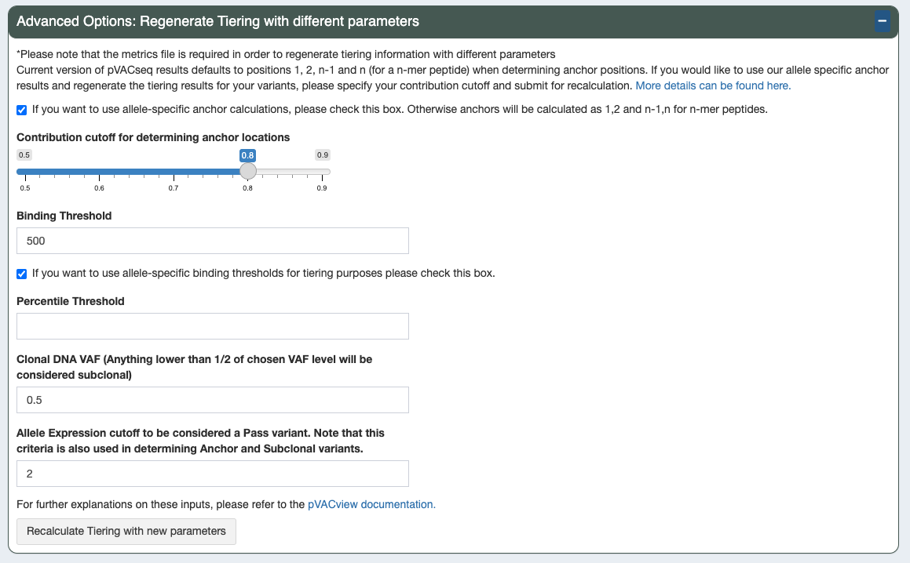
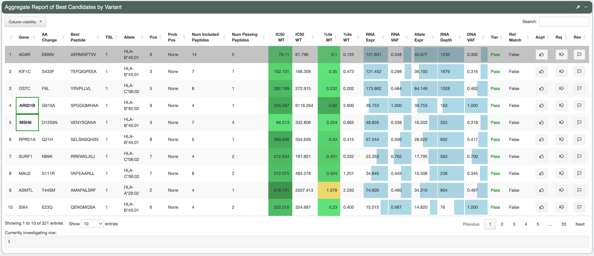
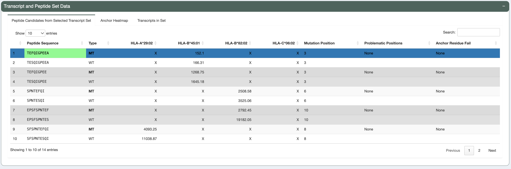
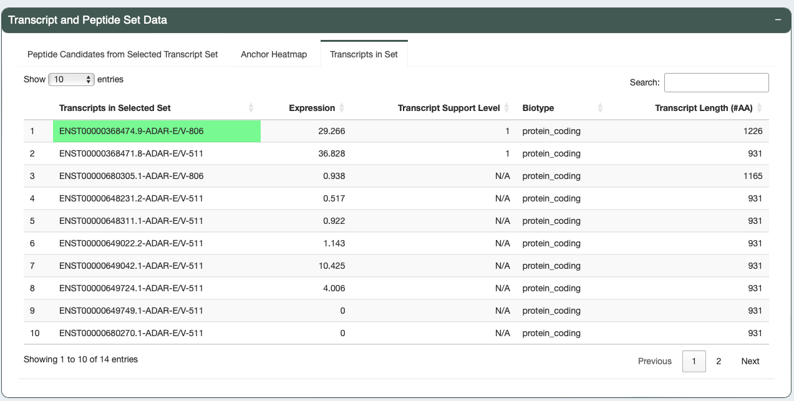
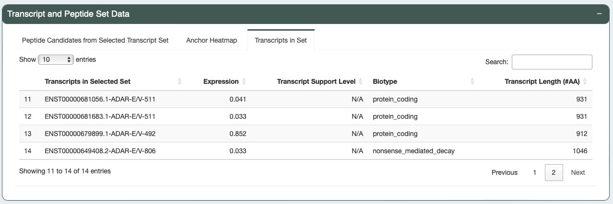
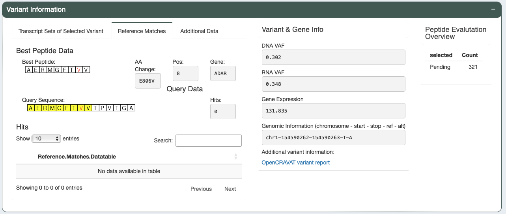
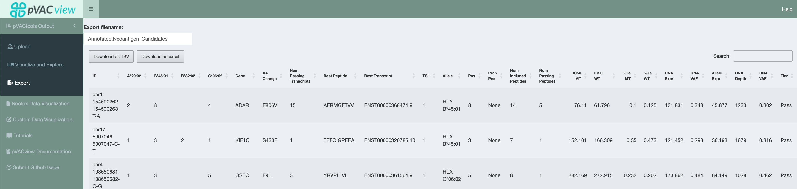

.. image:: ../../images/pVACview_logo_trans-bg_sm_v4b.png
    :align: right
    :alt: pVACview logo

.. _pvacseq_vignette:

Vignette - Using pVACview to Evaluate Neoantigen Candidates
-----------------------------------------------------------

In this vignette, we will use demo data to demonstrate using pVACview to evaluate neoantigen candidates predicted by pVACseq. The demonstration dataset includes Class I and Class II neoantigen candidate files generated from the HCC1395 breast cancer cell line and its matched lymphoblastoid cell line HCC1395BL. You can also download the demo data `here <https://github.com/griffithlab/pVACtools/tree/master/pvactools/tools/pvacview/data>`_. 

Upload input data files
_______________________

First, navigate to the Upload page, and click on ``Load demo data``.
This will immediately load:

- A tsv of Class I data: a high level aggregated file that lists the best MHC-class-I predicted epitope for each variant, their binding affinity scores, and additional variant information (genomic coordinates, coverage, VAF, and expression of the variants and transcripts encoding the epitopes).
- A json file of Class I data: JSON file with detailed information about the predicted epitopes, as well as meta-information about the original pVACseq run, formatted for pVACview.
- A tsv for Class II data: an aggregated file that lists the best MHC-class-II predicted epitope for each variant.
- A list of genes of interest: in this example, it's a tsv of the cancer census hotspot gene list from COSMIC.

Visualize and Explore
_____________________

You will next be taken to a view similar to this.

.. figure:: ../../images/screenshots/vignette/pvacview-mainviewDemodataset.png
    :width: 1000px
    :align: right
    :alt: pVACview Vignette
    :figclass: align-left

The top row of the page has 4 sections: 

- Advanced Options: Regenerate Tiering with different parameters
- Original Parameters for Tiering
- Current Parameters for Tiering
- Add Comments for selected variant

pVACview prioritizes neoantigen candidates by ranking these peptides based on a set of rules (:ref:`parameters for tiering <pvacseq_aggregate_report_tiers_label>`), which include variant allele fraction cutoff, gene/transcript expression, binding affinity predictions and more, as discussed later. Based on criteria described in the literature, we provide a default set of parameters for tiering, detailed in the **Original Parameters for Tiering** section. The default is a good starting point, but as all samples are unique in terms of sample quality, sequencing quality, tumor purity, tumor mutation burden, HLA type, etc. you may want to set your own parameters in the **Advanced Options: Regenerate Tiering with different parameters** section. To see the current set of rules applied to your data, see the **Current Parameters for Tiering** section.
Note: click the ``+``/ ``-`` in the right corner of a section to expand/contract the section.

The original parameters rank candidates on multiple facets:

**Clonality**

Cancer starts with a founding clone with tumor-initiating mutations which expand and drive malignancy. Descendents of the founding clone may acquire additional mutations. The default tiering assumes that neoantigen candidates derived from clonal variants should be prioritized as they exist in every cell of the tumor, while subclonal mutations are shared by some but not all of the cancer cells. It has been proposed that targeting such mutations will drive a better clinical response.

pVACview uses the following parameters when determining clonality:

- ``Tumor Purity`` : a value between 0 and 1 indicating the fraction of tumor cells in the tumor sample. (default: None)
- ``VAF Clonal`` : Tumor DNA variant allele frequency (VAF) to determine whether the variant is clonal. By default, this value is determined automatically from the VAFs in the input data during the original pVACseq run unless the tumor purity parameter is set (see :ref:`pVACseq docs <pvacseq_aggregate_report_tiers_label>` for further details). This can be adjusted by the user in pVACview (see below).
- ``VAF Subclonal`` : Tumor DNA VAF cutoff to determine whether the variant is subclonal. This value is automatically calculated as half of ``VAF Clonal``.

**Expression**

The ideal peptide candidate should be derived from a gene/transcript that is expressed robustly. We calculate allele expression by multiplying gene expression (often TPM or FPKM) by the RNA VAF and set a default cutoff of 2.5. Variants with expression lower than this cutoff will be marked with low expression. Users can adjust this cutoff based on their own knowledge of the dataset being analyzed:

- ``Allele Expression for Passing Variants`` : allele expression cutoff for passing variants. (default: 2.5 FPKM*VAF)

**Predicted Binding Affinity**

Binding affinity is measured by IC50 (peptide concentration required for 50% of displacement of a reference peptide to an MHC groove). Lower IC50 means a lower peptide concentration was required to achieve 50% displacement, which signifies better binding affinity. A common threshold for considering a peptide to be a strong binder is 500 nM. We also list the `Binding threshold` for inclusion in the Metric File. This parameter determines how many peptides the user wants to include in the peptide detailed view. Note that this parameter cannot be changed in the visualization component of pVACview but would need to be changed when generating the original aggregate report and metrics file. The default cutoff was set to 5000 nM to reasonably capture information about different peptide candidates from the same mutation but also to exclude those that have extremely poor binding.

- ``Binding Threshold``: IC50 value cutoff for a passing neoantigen. (default: 500 nM)
- ``Binding Threshold for Inclusion Into Metric File``: IC50 value cutoff for neoantigens to be loaded to pVACview. This feature helps limit the number of neoantigens being loaded to pVACview. (default: 5000 nM)
- ``Percentile Threshold`` : percentile score cutoff. (default: NULL)

When using the predicted IC50 values from binding prediction tools, another aspect to consider is the binding threshold of each allele. As stated earlier, different alleles may have allele-specific binding thresholds that vary from the default 500nM cutoff. Users can choose to use allele-specific binding threshold where data is available by turning this option on.

- ``Allele Specific Binding Threshold`` : this dictates whether the binding threshold is set specific to each allele based on `IEDB <https://help.iedb.org/hc/en-us/articles/114094151811-Selecting-thresholds-cut-offs-for-MHC-class-I-and-II-binding-predictions>`_ suggestion (option TRUE), or based on the ``Binding Threshold`` defined above (option FALSE). (demo data original value:  TRUE)

An important advantage of using pVACseq to generate neoantigen predictions is that multiple binding affinity algorithms can be run (namely up to 8 Class I binding affinity algorithms and up to 4 Class II binding affinity algorithms). However, the user will need to decide whether the lowest or the median prediction value across algorithms should be used as the binding metric (IC50 MT, IC50 WT, %ile MT, and %ile WT columns) for each peptide-HLA combination. This cannot be changed in pVACview but is determined during the initial pVACseq run. To view which score metric (median or lowest) was used to compare binding affinity of mutant (MT) and wildtype (WT) peptides, we provide:

- ``MT Top Score Metric`` : mutant top score metric. (default: Median)
- ``WT Top Score Metric`` : wildtype top score metric. (default: Median)

Aditionally, the ``HLA.Alleles`` and respective ``Binding.Cutoffs`` are also displayed.

- ``HLA.Alleles`` : is the list of HLA alleles that the sample expresses and given as input when running pVACseq.
- ``Binding.Cutoffs``: the IC50 cutoff value for the corresponding HLA allele. In the below example screenshots, allele-specific binding thresholds were used (``Allele Specific Binding Threshold: TRUE``). This results in the binding threshold for HLA-A*29:01 being set to the one recommended by `IEDB <https://help.iedb.org/hc/en-us/articles/114094151811-Selecting-thresholds-cut-offs-for-MHC-class-I-and-II-binding-predictions>`_. For the remaining alleles, IEDB does not have an specific binding threshold recommendation so the threshold is set to the basic binding threshold as a fallback, in this case 500 (``Binding Threshold: 500``).

**Transcript Support Level**

(`TSL <https://useast.ensembl.org/info/genome/genebuild/transcript_quality_tags.html>`_) provides information on degree to which transcript isoforms are supported by experimental evidence. The existing TSL levels are: TSL1, TSL2, TSL3, TSL4, TSL5, TSLNA, with TSL1 being the best TSL level.  We suggest users using a higher TSL level cutoff (lower number) for higher confidence in the annotation of the targeted transcript. Default is set to be TSL1. 

- ``Maximum TSL`` : cutoff TSL level for a passing candidate. (default: 1)

Additionally, users have the option to consider percentile ranks on top of raw IC50 predictions. Percentile rank is a method used to predict binding affinity of a peptide by comparing it to a set of peptides with similar sizes. A lower percentile rank indicates stronger affinity. Percentile rank of less than 2% are generally
recommended for differentiating binders from non-binders (see `Jurtz, Vanessa et al. 2017 paper <https://www.ncbi.nlm.nih.gov/pmc/articles/PMC5679736/>`_). In contrast to IC50 predictions, percentile ranks allow a more normalized comparison across different HLA alleles that may have allele-specific binding cutoffs. This feature is turned off by default but can be turned on by the user and considered when regenerating Tiering across variants. 

**Anchor Positions**

Anchor positions can influence whether a neoantigen candidate may be recognized by the patient’s immune system. Thus, another aspect to consider is anchor contribution. A subset of  amino acid positions within the neoantigen candidate is more likely to face the TCR, while other positions are responsible for anchoring the peptide to the MHC. Anchor identity is determined by anchor likelihood score (more information about how the score is calculated `here <https://www.science.org/doi/10.1126/sciimmunol.abg2200?url_ver=Z39.88-2003&rfr_id=ori:rid:crossref.org&rfr_dat=cr_pub%20%200pubmed>`_). Anchor identity of the mutated amino acid can influence whether the neoantigen candidate is expected to induce an immune response or be subject to central tolerance of the immune system, as elaborated in the 4 scenarios discussed later. To examine whether the mutated amino acid is located at anchor position, we provide:

- ``Allele Specific Anchors Used`` : if TRUE, likelihood score is used to determine anchor position; if FALSE, position 1, 2, n-1 and n are set as anchor positions. (demo data original value: TRUE)
- ``Anchor Contribution Threshold`` : anchor likelihood score (between 0-1) cutoff to determine whether the amino acid is in anchor position. (default: 0.8)

.. rst-class:: three-images-row

.. image:: ../../images/screenshots/vignette/originalParametersForTiering/pvacview-OG_params_1.png
   :width: 45%
   :align: left
   :alt: pVACview Vignette

.. figure:: ../../images/screenshots/vignette/originalParametersForTiering/pvacview-OG_params_3.png
   :width: 45%
   :align: center
   :alt: pVACview Vignette

To set your own Tier-setting parameters, expand the **Advanced Options: Regenerate Tiering with different parameters** section and tailor the parameters as needed. Learn more about Advanced Options `here <https://pvactools.readthedocs.io/en/stable/pvacview/getting_started.html#regenerate-tiering>`_.

The second row of the page spans the **Aggregate Report of Best Candidates by Variant** section, which lists all neoantigen candidates in the provided input. Candidates with a higher Tier will be shown first, followed by candidates of lower Tiers (Order of Tiers: ``Pass``, ``Anchor``, ``Subclonal``, ``Low Expr``, ``NoExpr``, ``Poor`` - see `Tiering criteria <https://pvactools.readthedocs.io/en/latest/pvacseq/output_files.html#tiers>`_). Genes that match with the user-input genes of interest list will have a green box around them (for example, ARID1B and MSH6 are covered by a green box in this demo). This feature can be useful for highlighting neoantigens derived from cancer driver genes.

To view the variant, transcript, and peptide level information of a desired candidate, click on the ``Investigate`` button on the right side of the row for that candidate. The candidate currently under investigation will be framed in blue. The number of the row currently being investigated is indicated at the bottom of this section.

Next, we will evaluate some neoantigen candidates using the original parameters for Tiering.

Example 1: a good candidate: KIF1C-S433F: TEFQIGPEEA
^^^^^^^^^^^^^^^^^^^^^^^^^^^^^^^^^^^^^^^^^^^^^^^^^^^^

.. figure:: ../../images/screenshots/vignette/KIF1C-new/KIF1C_0.png
    :width: 1000px
    :align: right
    :alt: pVACview Vignette
    :figclass: align-left

**Variant-level assessment:**

The variant has good DNA and RNA VAF (the DNA VAF is 0.316, higher than the Subclonal threshold of 0.25, thereby pVACseq assumes that the variant is clonal).

In this case, there’s only 1 mutant transcript that matches with the user-provided RNAseq data (**Transcript Sets of Selected Variant** tab shows only 1 result).

.. figure:: ../../images/screenshots/vignette/KIF1C-new/KIF1C_1_TranscriptSetsOfSelectedVariant.png
    :width: 1000px
    :align: right
    :alt: pVACview Vignette
    :figclass: align-left

The predicted best peptide (neoantigen candidate) doesn’t have any match in the human proteome. This is ideal, since the candidate will more likely to be recognized by T cells and not ignored due to central tolerance.

.. figure:: ../../images/screenshots/vignette/KIF1C-new/KIF1C_2_ReferenceMatches.png
    :width: 1000px
    :align: right
    :alt: pVACview Vignette
    :figclass: align-left

**Transcript-level assessment:**

The variant is detected in only 1 transcript. This transcript has good expression and Transcript Support Level. 

You can see the mutant (MT) and wildtype (WT) peptide sequence for this transcript side-by-side.

**Peptide-level assessment:**

The candidate being investigated has a good binding affinity (median IC50 score is less than 500nM, percentile rank is less than 2%). Elution scores vary with algorithms but overall the mutant peptide has better elution scores than the wildtype peptide, and the elution scores are close to 1.

.. figure:: ../../images/screenshots/vignette/KIF1C-new/KIF1C_9_BindingData.png
    :width: 1000px
    :align: right
    :alt: pVACview Vignette
    :figclass: align-left

.. figure:: ../../images/screenshots/vignette/KIF1C-new/KIF1C_10_ElutionAndImmunogenicityData.png
    :width: 1000px
    :align: right
    :alt: pVACview Vignette
    :figclass: align-left

The mutation is not in an anchor position (see ``Anchor heatmap`` tab). Anchor prediction scores for each amino acid position are provided in the ``Anchor Weights`` tab at the bottom. Both mutant and wildtype peptides are good binders, yet the mutant peptide is a stronger binder. This is scenario number 2 (WT strong binder, MT strong binder, MT not in an anchor position) according to the Scenario Guide, where the neoantigen candidate is favorable and can be accepted.

.. figure:: ../../images/screenshots/vignette/KIF1C-new/KIF1C_5_AnchorHeatmap.png
    :width: 1000px
    :align: right
    :alt: pVACview Vignette
    :figclass: align-left

Beside Class-I peptide, the best predicted Class-II peptide from user-input can also be reviewed, using the **Additional Data** tab.

**Decision:**

Given all the information above, we may conclude that the reviewed Class I peptide is potentially a good binder and choose to Accept this candidate in the ``Eval`` drop-down menu.

.. figure:: ../../images/screenshots/vignette/KIF1C-new/KIF1C_11_Decision_1.png
    :width: 1000px
    :align: right
    :alt: pVACview Vignette
    :figclass: align-left

.. figure:: ../../images/screenshots/vignette/KIF1C-new/KIF1C_11_Decision_2.png
    :width: 1000px
    :align: right
    :alt: pVACview Vignette
    :figclass: align-left

Example 2: a good candidate derived from a variant with multiple transcript sets: ADAR-E806V: AERMGFTVV
^^^^^^^^^^^^^^^^^^^^^^^^^^^^^^^^^^^^^^^^^^^^^^^^^^^^^^^^^^^^^^^^^^^^^^^^^^^^^^^^^^^^^^^^^^^^^^^^^^^^^^^

**Variant-level assessment:**

The variant has good DNA and RNA VAF (the DNA VAF is 0.302, higher than the Subclonal threshold of 0.25, thereby the variant is assumed to be clonal) . 

**Transcript-level assessment:**

Here, there are 2 transcript sets matching with the user-provided RNAseq data (**Transcript Sets of Selected Variant** tab shows 2 results). The transcript set highlighted in green (Transcript Set 1 in this case) is suggested as the best neoantigen candidate. Transcript Set 1 has 14 transcripts, all of which encode a stretch of amino acids (AERMGFTVVT) which gives rise to 3 different neoantigen candidates: AERMGFTVV, AERMGFTVVT, AERMGFTV. Transcript Set 2 has 1 transcript that encodes a stretch of amino acids (AERMGFTVLP), which gives rise to 3 different neoantigen candidates: AERMGFTVL, AERMGFTVLP, AERMGFTV.

The images below are transcripts in Transcript Set 1 (top-middle, 14 transcripts) and Transcript Set 2 (bottom, 1 transcript). The transcript with the best neoantigen candidate is highlighted in green.

The images below are the neoantigen candidates from Transcript Set 1 (top) and Transcript Set 2 (bottom). The best neoantigen candidate (AERMGFTVV) is highlighted in green. Here, candidates are ranked based on IC50 score - the best candidate has the lowest IC50 score. The Biotype, TSL, existence of problematic positions, and whether or not the peptide failed the anchor evaluation are also taken into account and candidates failing these criteria are deprioritized over candidates passing these criteria. As a result, a candidate with the lowest IC50 score is not always selected as the best peptide if these criteria aren't met.

.. figure:: ../../images/screenshots/vignette/ADAR/TranscriptSet1/ADAR_3_TranscriptSet1.png
    :width: 1000px
    :align: right
    :alt: pVACview Vignette
    :figclass: align-left

**Peptide-level assessment:**

For simplicity, we will review only the best peptide (AERMGFTVV) of the six candidates mentioned above. This candidate has good binding affinity (the median IC50 is 76.11nM, which is less than the 500nM cut-off; the median percentile is 0.125, which is less than recommended value of 2; the predictions from all algorithms are in high agreement with no outliers, as seen in the violin plot).

The candidate also has good elution scores (elution scores close to 1). It's unclear whether the candidate is likely to trigger Tcell response, since  immunogenicity percentile scores were not provided (two algorithms BigMHC_IM and DeepImmuno do not predict immunogenicity percentile scores).

Altogether, both the candidate (mutant peptide - MT) and its wildtype (WT) peptide are strong binders. The figure below shows the mutated amino acid (V) in the candidate is not in an anchor position. This fits into Scenario 4 in the guide, where the candidate is likely to elicit strong recognition from the immune system.

The candidate sequence also has no match with any known peptide in the human proteome.

**Decision:**

Given all the information above, we can conclude that the reviewed Class I peptide is potentially a good binder and choose to Accept this candidate in the ``Eval`` drop-down menu.

Example 3: a bad candidate: ZNF141-H389Y: KIYTGEKPY
^^^^^^^^^^^^^^^^^^^^^^^^^^^^^^^^^^^^^^^^^^^^^^^^^^^
.. figure:: ../../images/screenshots/vignette/ZNF141/ZNF141_0.png
    :width: 1000px
    :align: right
    :alt: pVACview Vignette
    :figclass: align-left

**Variant-level assessment:**

Given that the allele expression for passing variants is set at 2 (and a lot of gene has allele expression in the range of 5-114), ``Allele expression`` of this ZNF141 variant is low (1.824). 

Furthermore, the candidate peptide KIYTGEKPY matches with a sequence in the human reference proteome.

These potentially problematic characteristics are also flagged by the red boxes at the **Aggregate Report of Best Candidate by Variant** section.

**Decision:**

Since the candidate peptide has a match in the reference proteome, we will reject this candidate.

Export
______

After reviewing candidates, you can download the file with evaluation as a tsv or as an excel sheet.

