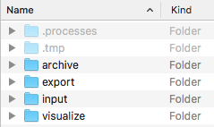

.. image:: ../images/pVACviz_logo_trans-bg_sm_v4b.png
    :align: right
    :alt: pVACviz logo

.. _pvacviz_directories:

pVACapi Directories
===================

    pVACapi directories

pVACviz, in order to provide all its features, communicates with a pVACtools component called pVACapi. pVACapi serves as an interface between pVACviz and the pVACseq pipeline proceses, launching pVACseq processes, managing them as they execute, and generating the visualizations that pVACviz displays.

Upon installation, pVACapi creates several directories in the user's home directory in `~/pVAC-Seq/`. These directories are used to hold input files to pVACseq processes, results files for visualization, archives, and exported projects. Additionally two hidden directories controlled by pVACapi are used to store files related to managing and running processes.

\/archive
---------
pVACviz provides an archive function within its :ref:`Manage section <pvacviz_managing>`. When processes are archived they are placed in this archive folder.

\/export
--------
pVACviz provides an export function within its :ref:`Manage section <pvacviz_managing>`. When processes are exported they are placed in this export folder.

\/input
-------
The pVACviz :ref:`Start form <pvacviz_starting>` has Input VCF and Phased Proximal Variant fields that accept VCF files. The selectors for these fields list all relevant files placed within the ``~/input`` directory. You may sort these files into directories of any depth and the selectors will keep them grouped by directory.

\/visualize
-----------
The :ref:`Visualize feature <pvacviz_visualizing>` allows users to visualize any pVACseq result TSV files. Any pVACseq TSV file placed in this /visualize folder will be displayed on the Visualize page in the right column. Directory structures will be preserved so that users may group files in whatever manner they wish.

\/.processes
------------
This is a hidden directory used to store all files related to processes that pVACapi is actively managing. These are the processes listed on the Manage page. You shouldn't touch anything in this directory. Instead, to gain access to these files use the Export or Archive function available in the pVACviz :ref:`Manage section <pvacviz_managing>`.

\/.tmp
------
This hidden directory is used by pVACapi to store temporary artifacts of the pVACseq pipeline. Editing or deleting anything in this directory may disrupt running pVACseq processes.
