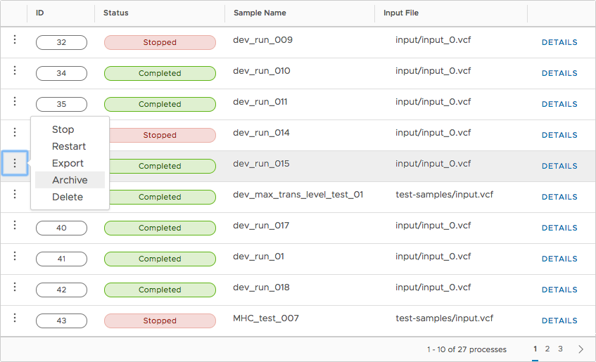
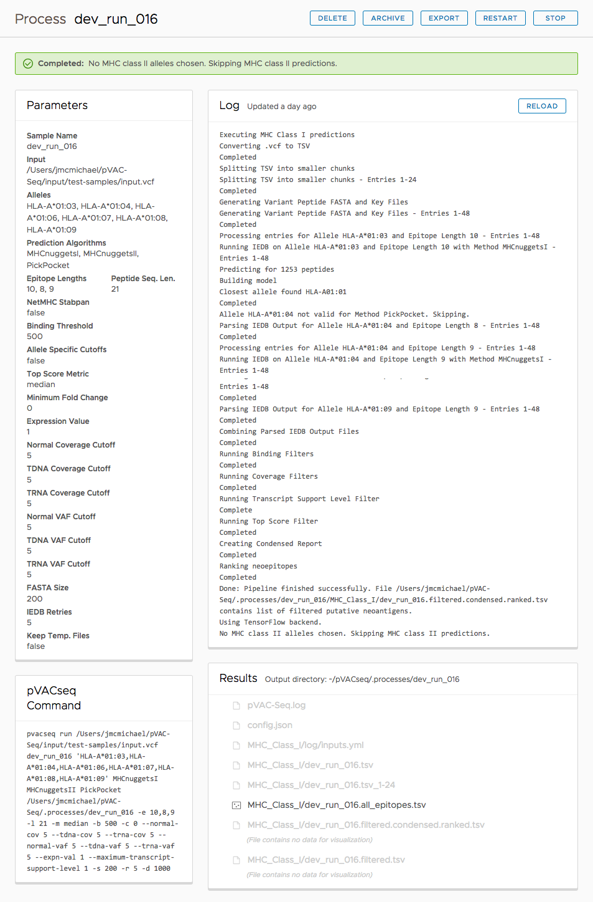

.. image:: ../images/pVACviz_logo_trans-bg_sm_v4b.png
    :align: right
    :alt: pVACviz logo

.. _pvacviz_managing:

Managing Processes
==================
With its management interface, users may manage processes launched with pVACviz. The Manageme section of the application is comprised of two pages: a list page that shows all the currently managed processes; and a detail page that displays all of the details of an individual process.

Displaying All Managed Processes
---------------------------------------------
When you click on the Manage link in the sidebar, you will be presented with a table containing a paged list of all currently managed processes.

    pVACviz Process List on Manage page

The process table displays each Process' ID, Status, Sample Name, and Input File, and provides a link to the detailed view of each process. A paging interface allows you to page through all running processes.

Each row provides an actions popup menu allowing you to stop, restart, export, archive, and delete processes. Clicking on the three dots at the left side of every row will display a menu of actions that will be applied to the process on that row. See below for a table detailing the actions available to you.

Displaying Process Details
--------------------------
Clicking on the Details link from the main Manage page in a process row displays the Process Detail page shown below. On this page you may view all the details of a process: its log, pVACseq command line arguments, and associated files. Any visualizable files will be shown with a Visualize link which, when clicked, will load the visualization for that results file.

All commands available in the process table are also available here in the header: stop, restart, export, archive and delete. See the table below for more details on these actions.

    pVACviz process detail display

Process Actions
---------------
Both the process list table and process detail page provide actions for users to manage pVACseq processes. The process table makes these actions available in its action menu, displayed by clicking on the three dots on the left of every row. The process detail page provides buttons in its header to invoke process actions.

=========== ==============
Action      Description
=========== ==============
Stop        Stops a running process. Note that a process must be stopped before it can be restarted, exported, archived, or deleted.
Restart     Restarts a running process. Note that all progress will be lost; pVACseq does not yet restart processes at the point they were stopped.
Export      Exports all a process' config, log, intermediate, and final results files (if any) to the :ref:`\/export directory <pvacviz_directories>`. The process will remain in the set of pVACapi managed processes.
Archive     Similar to Export, Archive moves all process config, log, intermediate, and final results files (if any) to the :ref:`\/archive directory <pvacviz_directories>`. Unlike Export, Archive removes the process from pVACapi's set of managed processes.
Delete      Deletes all process files, directories and removes it from pVACapi's set of managed proceses. Be careful! This action is not undoable.
=========== ==============
